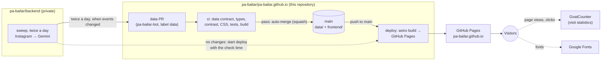
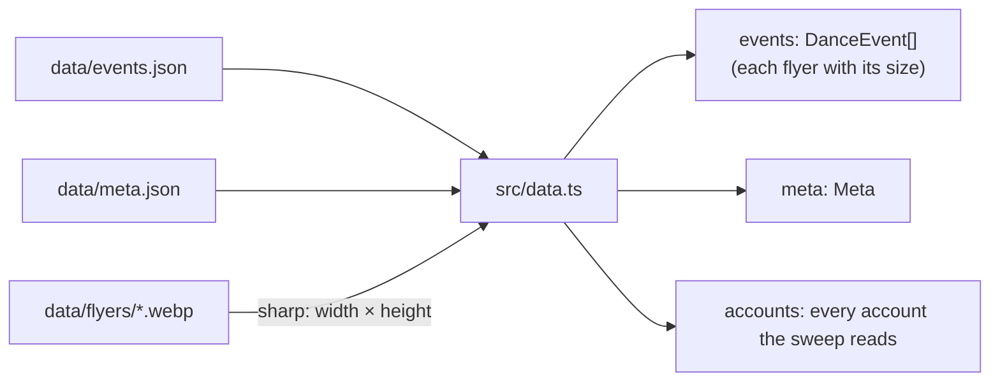
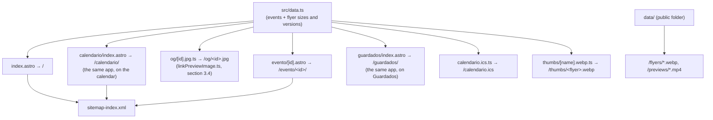
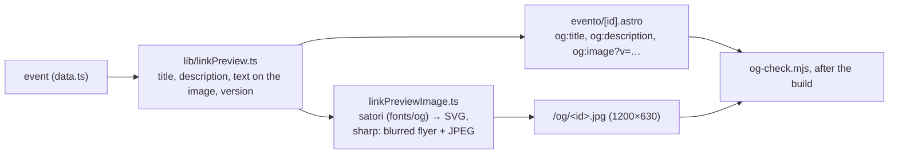
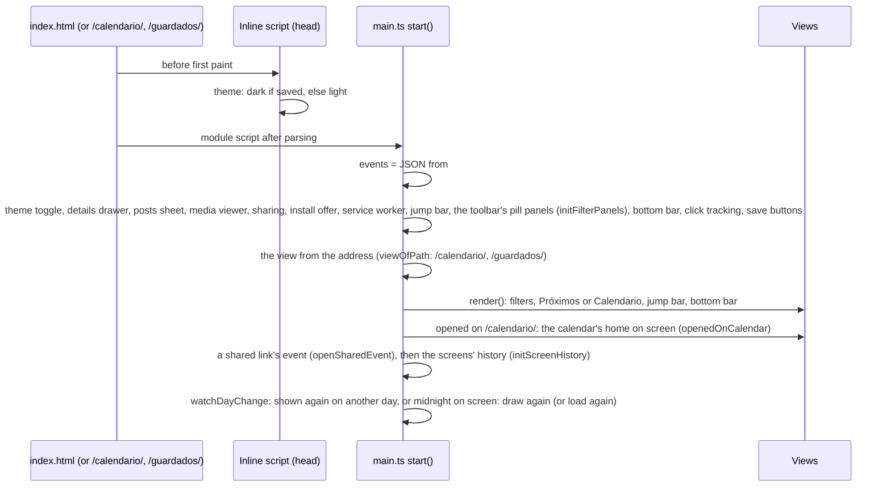
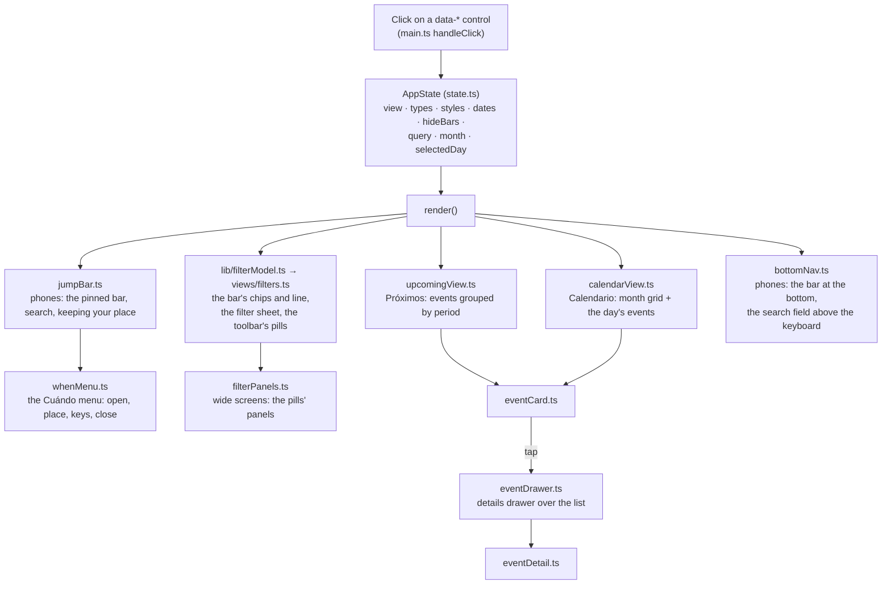
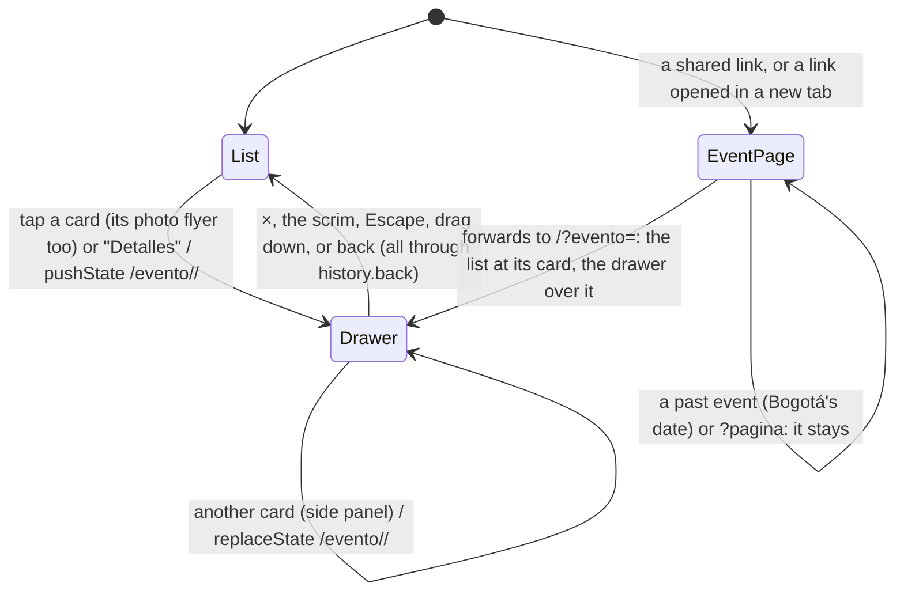

# Pa' Bailar: architecture (site)

How the site at <https://pa-bailar.github.io> gets its data, how it's built and published, and how it
works in the visitor's browser. This repository (`pa-bailar/pa-bailar.github.io`, public) holds the
site and the published data.

The collector that produces the data (Instagram → Gemini) is a separate, private repository
(`pa-bailar/backend`). Its `docs/ARCHITECTURE.md` covers the whole system's infrastructure in depth:
external services, the sweep, quotas, monitoring.

Related documents in this repository:
- [`DATA.md`](DATA.md): the data contract, every field of `events.json`.
- [`DESIGN.md`](DESIGN.md): the design system, every visual rule.

Last reviewed: 5 October 2026.

Contents:

1. [The site in one picture](#1-the-site-in-one-picture)
2. [How data reaches the site](#2-how-data-reaches-the-site)
3. [The build: from data/ to static files](#3-the-build-from-data-to-static-files)
4. [Publishing: workflows and protection](#4-publishing-workflows-and-protection)
5. [In the browser](#5-in-the-browser)
6. [Dates, time zones and holidays](#6-dates-time-zones-and-holidays)
7. [Third-party services](#7-third-party-services)
8. [Quality checks](#8-quality-checks)
9. [Code map](#9-code-map)
10. [Working on the site](#10-working-on-the-site)

---

## 1. The site in one picture

The site is **fully static**: HTML, CSS, a little JavaScript and images. It's built by Astro, served by
GitHub Pages, and has no server, database or API of its own. All of its data is in `data/`, which the
backend updates through pull requests.



| Folder | What | Who writes it |
|---|---|---|
| `data/` | `events.json`, `meta.json`, `archive/<year>.json` (past events, read by no page). Also the site's public folder: the flyers (`flyers/*.webp`) and videos' clips (`previews/*.mp4`) are served from it as-is, but **they aren't in this repository**: they live in `pa-bailar/media` and are copied in before every build and check (`.gitignore`; the backend's ARCHITECTURE §10.2). Images in this repository grew its history by hundreds of MB a year, and data PRs keep every old image alive (5 Oct 2026) | The backend: the data through data PRs, the images straight to `pa-bailar/media` |
| `frontend/` | The Astro site: pages, components, scripts, styles, tests | People, through PRs |
| `docs/` | Architecture (this file), data contract, design system | People |
| `.github/workflows/` | `ci` and `deploy` | People |

---

## 2. How data reaches the site

The backend's sweep runs twice a day, at 9 AM and 9 PM Bogotá time (cron-job.org starts its workflow), and
reads each account about once a day. It works on a checkout of this repository and writes `data/` exactly
as described in [`DATA.md`](DATA.md).

```mermaid
sequenceDiagram
    autonumber
    participant B as Backend sweep (GitHub Actions)
    participant R as This repository
    participant CI as ci workflow
    participant D as deploy workflow
    participant P as GitHub Pages

    B->>R: check out main (anonymous: the repository is public)
    B->>B: copy pa-bailar/media's images in; write data/events.json, data/meta.json, data/flyers/, data/previews/
    B->>B: push new and changed images to pa-bailar/media (no PR)
    alt events.json or the archive changed
        B->>R: push branch data/sweep-<day>-<run> (as pa-bailar-bot)
        B->>R: open PR "chore(data): daily sweep <day>", label data, enable auto-merge
        R->>CI: pull_request
        CI->>CI: check-data, astro check, contrast, CSS properties, tests, build
        CI-->>R: ci passed
        R->>R: squash merge (ruleset: ci required), delete branch
        R->>D: push to main
        D->>P: build and publish
    else nothing changed
        B->>D: workflow_dispatch with checked_at = time of the check
        D->>P: build and publish ("Actualizado el …" stays current)
    end
```

Notes:
- **Only real changes open a PR.** `meta.json` is rewritten on every run, but only events or flyers
  count as a change.
- **The bot's PRs are checked like anyone's.** The backend uses a GitHub App (pa-bailar-bot), not the
  default workflow token, whose PRs wouldn't trigger this repository's `ci`.
- **A data PR can't break the site.** `check-data.mjs` checks every field against the contract, and the
  build must succeed before the PR can merge; otherwise the data PR stays open and the backend's run reports it.
- **"Actualizado el …"** in the header shows when the data was last **checked**, not when it last
  changed:
  - on days without changes, the backend starts the deploy with `checked_at`, which reaches the build as
    `PUBLIC_CHECKED_AT`;
  - otherwise, the build uses `meta.json`'s `generated_at`.
- **Old events leave on their own:** the backend archives events dated more than 60 days ago
  (`data/archive/<year>.json`, read by no page) and deletes their full flyers and clips. Past events still in the data aren't shown in "Próximos", but their pages and the
  calendar keep them.

---

## 3. The build: from data/ to static files

`npm run build` (Astro 7). `astro.config.mjs` sets:
- the site's URL (`https://pa-bailar.github.io`);
- **`publicDir: "../data"`**, so the data folder is served at the site's root: `flyers/123-0.webp`
  becomes `https://pa-bailar.github.io/flyers/123-0.webp`;
- the `@astrojs/sitemap` integration;
- `import.meta.env.DATA_DIR`, the data folder's absolute path, so the build finds the flyers wherever
  it's started from, and `import.meta.env.ASSETS_DIR` (`src/assets/`: the home page's link preview);
- the Content Security Policy (`security.csp`, section 3.3) and the `csp-meta` integration that checks it;
- the `og-check` integration: checks every event's link preview (section 3.4);
- the `sw-precache` integration: writes the build's file names (`/_astro/`) into `sw.js`, which stores them when it
  installs (section 3.2);
- the `module-preload` integration (`scripts/module-preload.mjs`): each page's module script (at the end of its body)
  and the shared chunk it imports are announced in `<head>` with `<link rel="modulepreload">`, so the chunk isn't one
  more round trip after the script;
- `markdown.syntaxHighlight: false`: there's no Markdown, and Shiki's highlighting needs `style` attributes,
  which the policy blocks.

Astro is pinned to its minor version (`~7.3.5` in `package.json`, patches only): the policy's `<meta>` and
hashes come from Astro's `security.csp`, so a minor update can change what `csp-meta.mjs` reads. Update it on
purpose, then build and check the console.

### 3.1 Reading the data: `src/data.ts`



- **Typed once:** the JSON is cast to the types in `src/scripts/types.ts`, which mirror the backend's
  models. CI checked the files against the contract first.
- **Flyer versions:** each flyer's media item also gets `version`, a short hash of its file (`src/images.ts`,
  `fileVersion`). The backend can remake a flyer under the same name, so its URL carries the version (`?v=`,
  `flyerUrl` and `thumbUrl` in `lib/links.ts`): a new file is a new URL for browsers and the service worker, and
  every other image keeps its URL (section 3.2, `/sw.js`).
- **Flyer sizes:** each flyer's pixel size is read at build time and added to its media item. Cards then
  show each flyer at its own shape without the page jumping while images load (section 5.4).
- **Build time only:** `data.ts` uses Node (`sharp`, the file system). The browser never imports it; it
  gets the data inside the page.

### 3.2 What the build generates

| Output | Source | What it is |
|---|---|---|
| `/` (`index.html`) | `pages/index.astro` (its body: `components/HomePage.astro`) | The app: header, toolbar, jump bar, the three views (the list, the calendar, Guardados), details drawer, filter sheet. Every event is embedded as JSON (`<script type="application/json" id="events-data">`, `src/pageData.ts`, without `doubts`), and the browser renders the cards and calendar from it. Its preview image is `/og/sitio.jpg` |
| `/calendario/` | `pages/calendario/index.astro` | The same app opening on the calendar (`HomePage.astro` with `view="calendar"`; `main.ts` reads the address with `viewOfPath`), so a reload or a shared link stays on it. Each view's title and description: `lib/viewTitles.ts` |
| `/guardados/` | `pages/guardados/index.astro` | The same app opening on the visitor's saved events (`view="saved"`). Not indexed (`noindex`) nor in the sitemap: it's each visitor's |
| `/evento/<id>/` | `pages/evento/[id].astro` | One page per event: where a shared link points. A browser is forwarded to the home page with the event open over the list, unless it's past (section 5.3). Rendered at build time: the flyer, then the same details as the drawer. Includes the link preview's tags (section 3.4) and schema.org `Event` data (section 6) |
| `/og/<id>.jpg` | `pages/og/[id].jpg.ts` | Each event's link-preview image: 1200×630, the flyer with the date, title, place and price (section 3.4) |
| `/og/sitio.jpg` | `pages/og/sitio.jpg.ts` | The home page's link preview. Drawn once with the site's fonts by `scripts/og-site.html` and stored as `src/assets/og-site.jpg` |
| `/thumbs/<flyer>.webp` | `pages/thumbs/[name].webp.ts` | A small square thumbnail of every flyer, for where flyers show small (the posts sheet, summarized periods, the 404 page, a shared list's image), so they load at once on a phone |
| `/calendario.ics` | `pages/calendario.ics.ts` | A subscribable calendar feed (iCalendar) with every event, a workshop series as one entry per session (`lib/calendarFeed.ts`, section 6). Rebuilt with the site. Not linked anymore; kept so existing subscriptions keep working |
| `/manifest.webmanifest` | `pages/manifest.webmanifest.ts` | What lets a phone install the site like an app: name, colors, icons, full screen |
| `/icons/<name>.png` | `pages/icons/[name].png.ts` | The app icons (192, 512, maskable 512, Apple touch icon), made from SVG at build time |
| `/sw.js` | `pages/sw.js.ts` | The service worker: makes the site installable and opens it offline with the last events. **Precache:** installing it stores the app's pages (`/`, `/calendario/`, `/guardados/`) and every build file (`/_astro/`, listed after the build by `scripts/sw-precache.mjs`), so it works offline from the first visit; offline, an address never stored gets the home page, and an unstored event page the app with that event open (`/?evento=<id>`). **Pages: network first**, the stored copy when offline or after a timeout (`NAVIGATION_TIMEOUT_MS`). **Build files: cache first**, in a cache named by a hash of their list, so a data-only deploy downloads none of them again. **Images:** flyers and thumbnails share one cache kept across builds (`images`, capped at `IMAGE_LIMIT`), keyed by their versioned URL (`?v=`, section 3.1): a remade flyer is a new URL that replaces its older copies. Never name this cache by a hash of the flyers: every sweep would then empty it. Copies are stored without holding back the response (`waitUntil`); the first visit's flyers are sent to the worker once it controls the page (`registerServiceWorker`, `views/installPrompt.ts`) |
| `/sitemap-index.xml` | `@astrojs/sitemap` | Home, the calendar and every event page, for search engines (the 404 page is excluded) |
| `/404.html` | `pages/404.astro` | For an old event link: "Este evento ya pasó o no existe", the next upcoming events as of the build, and a link home. Any other address gets "Esta página no existe" (a small script reads the path) |
| `/flyers/*.webp` | `data/flyers/` (public folder) | The flyers, copied as they are |
| `/previews/*.mp4` | `data/previews/` (public folder) | Videos' clips (short, silent), copied as they are |



**Shared code between build and browser:** the views in `src/scripts/` produce HTML strings, so the same
code renders an event's detail in the browser (the details drawer) and at build time (the event page).

### 3.3 The Content Security Policy

GitHub Pages can't send headers, so the policy is a `<meta http-equiv="content-security-policy">` in every
page. It tells the browser what the page may load and run; anything else (a script or style slipped into an
event's text, a link to another site's script) is blocked.

| Directive | Allows | For |
|---|---|---|
| `default-src` | `'self'` | Anything not listed below: only the site's own files |
| `script-src` | `'self'`, `https://www.instagram.com`, hashes | The build's bundles, our copy of GoatCounter's `count.js`, Instagram's `embed.js`; the inline scripts by their hash |
| `style-src` | `'self'`, `https://fonts.googleapis.com`, hashes | The CSS files, Google Fonts' stylesheet, the styles Astro inlines (by hash) |
| `style-src-attr` | `'unsafe-hashes'` + one hash | No `style=""` attributes, except the fixed one `embed.js` gives Instagram's player |
| `img-src` | `'self'`, `data:`, `https://jzamora9.goatcounter.com` | Flyers, thumbnails, icons; the favicon (a `data:` SVG); GoatCounter's fallback image |
| `media-src` | `'self'` | The videos' clips (`previews/`) |
| `font-src` | `https://fonts.gstatic.com` | Google Fonts |
| `connect-src` | `'self'`, `https://jzamora9.goatcounter.com` | GoatCounter's counts (`sendBeacon`) |
| `frame-src` | `https://www.instagram.com` | Instagram's player |
| `worker-src`, `manifest-src` | `'self'` | `sw.js`, `manifest.webmanifest` |
| `object-src`, `base-uri`, `form-action` | `'none'` | No plugins, no `<base>`, no forms |

- **Where it's set:** `astro.config.mjs` (`security.csp`). Astro adds the hashes of the scripts and styles it
  inlines. Ours are two inline scripts, the theme before first paint (`src/themeScript.ts`, in `BaseLayout.astro`) and the event pages'
  forward to the app (`evento/[id].astro`), written as strings and added with `allowInlineScript()`
  (`src/csp.ts`), which puts their hash in the page's policy.
- **Checked at every build** (`scripts/csp-meta.mjs`): Astro writes the `<meta>` at the end of `<head>`, where
  it wouldn't cover what comes before it; the integration moves it right after `<meta charset>`. It also fails
  the build if a page has an inline script or `<style>` the policy doesn't allow, any `style=""` attribute, or any
  inline event handler (`onclick=""`, `onerror=""`…).
  So a new inline script needs `allowInlineScript()`, and a style that depends on data is set from a script
  (`element.style`, which the policy allows), like the cards' flyer shape (`applyFlyerRatios`, `eventCard.ts`).
- **What a `<meta>` can't do:** `frame-ancestors`, `sandbox` and reports need a response header, and GitHub Pages
  sends none. Other sites can frame the pages; with no accounts or forms, that leads nowhere.
- **`npm run dev` doesn't apply it** (Vite's dev server injects scripts). To try it: `npm run build` and
  `npm run preview`, then look for "Content Security Policy" errors in the console.

### 3.4 Link previews

What WhatsApp, Instagram, iMessage, Telegram and Facebook show when an event's link (`/evento/<id>/`) is shared.
They read the page's Open Graph tags (they don't run scripts) and download its image.



- **The text** (`scripts/lib/linkPreview.ts`, pure, tested): the title with the date (over several days, the
  range without the time; a workshop series from its first session), the description (type, place, price), the
  image's `alt`. Apps keep a preview for days, so dates are always real ones, never "Hoy" or "Mañana".
- **The tags** (`BaseLayout.astro`): the Open Graph tags (`og:image` absolute, with `?v=`, its width, height, type
  and alt) and `twitter:card` `summary_large_image`. Without the size, Facebook and WhatsApp may show no image on a
  link's first share. The home page keeps its own image (`/og/sitio.jpg`), with the same tags.
- **The image** (`src/linkPreviewImage.ts`, `pages/og/[id].jpg.ts`): 1200×630 (1.91:1, what every app shows whole).
  Its design is in [`DESIGN.md`](DESIGN.md), "Link previews".
  - **Text with the site's fonts:** satori turns the text into SVG paths, with the TTF files in
    `src/assets/fonts/og/` (each with its license): the build machine has no fonts, and satori reads neither WOFF2
    nor system fonts. satori's version is pinned (`package.json`): an update can move text, so check the images
    after one.
  - **The flyer:** sharp puts the whole flyer over a blurred copy of itself, draws the SVG on top and writes a JPEG,
    written again at lower quality if it would pass 280 KB. An event without a flyer gets the app icon's record.
  - **Cost:** about 0.12 s and 115 KB per event (with 77 events, about 10 s more per build).
- **Corrections reach the apps** (`?v=`): apps cache a preview by its URL, and GitHub Pages can't send cache headers.
  So the image's URL carries a short hash of what it shows (`previewVersion`, including `PREVIEW_DESIGN_VERSION`:
  bump it when the design changes). A corrected event gets a new URL, which apps fetch again; a change the image
  doesn't show keeps the old one.
- **Checked at every build** (`scripts/og-check.mjs`): every event has its page with all the tags, and its
  `og:image` has a version and points to a 1200×630 JPEG the build made, under 280 KB (WhatsApp skips larger
  preview images). Otherwise the build fails.
- **Old links:** a deleted event's page and image go with it (section 2); its link opens the 404 page (section 3.2).

---

## 4. Publishing: workflows and protection

### 4.1 Workflows

| Workflow | Trigger | Steps | Permissions |
|---|---|---|---|
| `ci` | Every pull request (including data PRs, and title edits); manual | The PR title (Conventional Commits, `release.mjs check`). The images from `pa-bailar/media` copied into `data/` (its latest version, `flyers/` and `previews/` only; a missing folder is fine: git keeps no empty one). `npm ci`, `npm run check` (section 8), `npm test`, `npm run build` | `contents: read` |
| `deploy` | Push to `main` (every merged PR); manual; the backend's sweep on days without changes (with `checked_at`) | **version**: the version from the commits since the last tag (`release.mjs plan`) and its release notes. **build**: the images from `pa-bailar/media` copied into `data/`; `npm ci`, `npm run check`, `npm run build` (with `PUBLIC_CHECKED_AT` and `PUBLIC_VERSION`), upload the Pages artifact. **deploy**: publish to GitHub Pages. **release**, only after a successful deploy and when the commits change the site: tag the version and publish its GitHub Release. A failed build or deploy tags nothing | Version and build: `contents: read` (the build runs npm's install scripts). Deploy: `pages: write`, `id-token: write`. Release: `contents: write` (it runs no npm package, only `gh`) |

- **One deploy at a time:** `concurrency: pages` without cancelling, so two merges in a row publish one
  after the other.
- **Node:** version 24 (`.nvmrc`), with an npm cache keyed on `frontend/package-lock.json`.
- **Versions:** squash merges make each PR one commit on `main`, titled like the PR. `feat` → minor,
  `fix`/`perf`/`refactor`/`copy`/`style`/`revert` → patch, `!` or `BREAKING CHANGE:` → major; `docs`, `chore`
  (data), `ci`, `test`, `build` → no version. The footer shows the version, linked to its release.

### 4.2 Protection of `main`

The `protect-main` ruleset is active with **no bypass**, for anyone including administrators and the bot:
- changes only arrive through pull requests;
- merges are squash only;
- the `ci` check must pass;
- force pushes and deleting `main` are blocked.

The repository allows auto-merge and deletes merged branches. Data PRs (label `data`) enable auto-merge
when opened, so they merge on their own once `ci` passes.

### 4.3 GitHub Pages

- **Source:** "GitHub Actions" (`build_type: workflow`): Pages serves whatever the `deploy` workflow
  uploads, not a branch.
- **URL:** the repository's name (`pa-bailar.github.io`) makes it the organization's root site:
  `https://pa-bailar.github.io/`.

---

## 5. In the browser

### 5.1 Start-up



- **No data request:** the events arrive inside the HTML, so the first render needs no network.
  The flyers load lazily as they come into view.
- **Shown again on another day** (`views/dayChange.ts`, `watchDayChange`): an installed app left open overnight, or a
  tab from yesterday. When the page is shown again on another Bogotá day, the calendar moves to today if it was on
  that day, and everything is drawn again ("Hoy", past events). Hours after it loaded (`STALE_AFTER_MS`) and online,
  it reloads instead, since the events are embedded at build time. A page on screen across Bogotá's midnight is drawn
  again then too (`untilNextDay`; never a reload under the visitor's eyes).
- **One delegated click listener** in `main.ts` handles every control marked with a `data-*` attribute (`CONTROLS`:
  each attribute with its named handler, tried in order: `data-when-open`, `data-pill`, `data-open-filters`,
  `data-show-period`, `data-event` (a card's title, its "Detalles" and its image, `data-card-image`: the details, or the lightbox with a mouse on a wide screen), `data-view`, `data-filter` + `data-value`, `data-month-step`,
  `data-today`…). It finds the control with `closest()`, so **no page-level element may carry one of these
  attributes**: the view on screen is marked on `<body>` as `data-screen`, never `data-view`, which made every click
  without a control of its own a tap on the current tab (5 Oct 2026; `savedView.test.ts` guards it).

### 5.2 State and rendering



- **The state is a plain object** (`state.ts`), and every change re-renders the visible parts. There's
  no framework: the views return HTML strings, inserted with `innerHTML` after escaping every value from
  the data (`lib/dom.ts`, `escapeHtml`).
- **Filtering** (`matchesFilters`): an event must pass every group (AND), and within the dates, the types and the
  rhythms any choice will do (OR):
  - **Dates** (`dates`, several): periods of the list ("hoy", "fin-de-semana", "2026-11"…) plus "manana"
    (`TOMORROW`). An event matches when any of its days from today falls in a chosen period (a workshop series counts
    only its sessions' days, `daysOf`), and the list shows it on its first such day (`listedDay`; see "The days
    shown" below). Upcoming list only: the calendar ignores them.
  - **Types** (`types`, several): social, workshop…
  - **Rhythms** (`styles`, several): filtering by a parent rhythm ("salsa") also matches its variants ("salsa caleña").
  - **Bars** (`hideBars`, off by default): while on, no event with `bar: true` (`isBar`, `matchesBars`). Not a group of
    options, so every count leaves the bars out while they're hidden; the model shows it as the removable choice "Sin
    bares" (`HIDDEN_BARS`), and its controls carry `data-filter="bars"`. **Remembered** in this browser (key
    `hide-bars`, `HIDE_BARS_KEY`, through `lib/storedSwitch.ts`), read once at start into
    `createInitialState({ hideBars })`. A shared link to a bar's event while they're hidden still opens its details
    (`openSharedEvent`).
  - **Search** (`query`; section 5.5): its words (`matchesWords`) and the days it names (`searchedDays`).
  - **The days shown** (`shownDays`, one rule for the dates and the search's days): of the days the view covers (the
    list's from today, `daysFrom`; the calendar's month; in Guardados the ones to come, or every day of a past event),
    those in a chosen period and among the days the search names, both. An event with none isn't shown; the list shows
    it under the first (`listedDay`), the calendar on each (`calendarDays`), and "Cuándo" counts its options on them
    (`dateOptions`). So a searched day narrows the days as "Cuándo" does: "viernes" shows a series on its Friday session
    only, never under "Hoy" for its session today (the bug hunt of 7 Oct 2026).

  Every path that shows events goes through `matchesFilters`: the list (`renderUpcomingView`), the calendar
  (`calendarDays` in `calendarView.ts`), the options' counts and the line (`filterModel`); `tests/hideBars.test.ts`
  guards it (no other script reads `bar` off an event). Guardados applies the search alone through the same
  `shownDays` (`savedLists`).

  The options (`filterModel` in `lib/filterModel.ts`, pure and tested; `dateOptions` in `state.ts`) exist by the events in
  view before any filter, in a stable order, so chips never move; each is counted against the other groups
  (`matchesFilters(event, state, except)`), and one with nothing to show is `dimmed` (unless chosen), not hidden. The
  model also gives the bar's "Cuándo" (`whenModel`), its chips (the types in view, in `TYPE_ORDER`), every choice in use
  (`applied`, named in the line under the bar; the bar never shows them as extra chips), Filtros' badge
  (`activeFilterCount`), the count shown and the line under the bar (`summaryLine`), and what the search alone finds
  (`searched`: with nothing shown, the sheet's button says whether to change the search or the filters,
  `resultsButtonLabel`). `clearFilters` ("Limpiar") clears dates, rhythms and types and shows the bars again, not the
  search nor Guardados. The other filters live only in memory, not in the URL or storage (`DESIGN.md`, "Filters");
  hiding the bars is the one remembered.
- **"Próximos"** groups upcoming events by period: today, this week, this weekend, next week, the rest
  of the month, then one group per month for the next six months, and one per year beyond that
  (`groupByPeriod`). An event over several days (`end_date`) is upcoming until its last day, and once it has
  started it's listed under "Hoy" every day it goes on (`shownDay` in `lib/dates.ts`). A workshop series (`sessions`)
  is upcoming until its last session and listed under its next session's day (`listOrder`, `startOn`); listed under
  another one (a day searched, a date chosen, the calendar's day, a past one too), its card says that session
  (`eventCardGridHtml`'s `listedOn`, `shownSession`'s `listed`). Near periods show a few flyers, then "Ver N más"; later periods start as a
  summary row (`DESIGN.md`, "Long lists").
- **"Calendario"** shows a month grid: days with events show dots on phones (`dotsHtml`) and names on wide screens,
  capped so a busy day never makes its week taller. Colombian holidays are tinted, and the selected day's events are
  listed below; whatever changes that list ends with its start on screen (`revealDay` in `views/viewNavigation.ts`).
  An event over several days is on each of its days (`groupByDay`), across months too; a workshop series only on its
  sessions' days. A day's events go by type in the owner's order, then by start time that day (`dayOrderKey` in
  `state.ts`, shared with the list's `listOrder`; `DESIGN.md`, "Upcoming list").
- **One date at a time in the bar:** an option of "Cuándo" sets `dates` to that one period (or none), its × empties
  them; the "Filtros" sheet still toggles several. Both read and write the same `dates`, so the bar, its line, the
  sheet and the toolbar always agree.
- **Keeping your place:**
  - when a filter changes while you're reading the list, the period you were in (the lowest one crossing a band
    under the bar, measured just before: `captureListPosition`) stays under the bar, and the chip that changed it
    gets the focus back without moving the page (`refocus` in `lib/focus.ts`: on Android a tapped chip has the focus,
    and putting it back with a scroll sent the page to the list's top; the bug-squash pass of 8 Oct 2026);
  - the list remembers where it was left, so switching to the calendar and back returns you to the same spot; to the
    same period if a filter changed meanwhile, to its start if the search did (`listComeback`). The calendar instead
    always opens on its home (`calendarHome` and `revealDay` in `views/viewNavigation.ts`; `DESIGN.md`, "Phones: feed,
    jump bar, the bar at the bottom and filter sheet").

### 5.3 The details drawer and URLs



- **The drawer is one `<dialog>`** (`EventDrawer.astro`, `views/eventDrawer.ts`) with one event's details in it
  (`eventDrawerHtml`: the head, the quick actions, the details). No flyer: the card is right there. Two modes, chosen
  when it opens and switched if the window crosses the breakpoint while open (`show` / `swapMode`; a phone in
  landscape keeps the drawer, since a side panel would cover the bar at the bottom):

  ```mermaid
  stateDiagram-v2
      state "Drawer (phones, under 900px wide or 600px tall; modal)" as Sheet {
          [*] --> Medium
          Medium --> Full: pull up, scroll the content, wheel, the handle, keyboard focus below the fold
          Full --> Medium: pull down from the bar or the content's top, wheel up at the top, the handle
      }
      state "Side panel (900 × 600px and up; not modal)" as Panel
      [*] --> Sheet: showModal()
      [*] --> Panel: show(), over the page
      Sheet --> [*]: ×, scrim, Escape, back, drag down from Medium
      Panel --> [*]: ×, Escape, back
  ```

  - **Drawer:** the dialog covers the screen with its own scrim and the panel, moved by `--drawer-y`. Its geometry
    and gestures are pure functions in `views/drawerSheet.ts` (tested): the two heights (`offsetFor`), the scrim
    (`scrimAt`), where a drag ends (`settle`, with the same release numbers as the bottom sheets, from
    `lib/sheetMotion.ts`), `exitDuration` and `cardScrollDelta` (keeping the tapped card in view). Touch: at half
    height every vertical drag moves the drawer; at full the content scrolls natively and the drawer follows a pull
    down from its bar or the content's top. A mouse or pen drags the bar. Motion uses the motion tokens (`tokens.css`,
    mirrored by `lib/motion.ts`); none with reduced motion.
  - **Modal:** `showModal()` makes the list inert and `html:has(dialog:modal)` stops it scrolling. The dialog has
    `autofocus`, so opening focuses the dialog itself, not its handle (focusing the handle, still off screen,
    scrolled the list). Closing gives the focus back to what opened it (read before `close()`).
  - **The opener drawn again:** the views draw new cards (a save in Guardados, a search), so the opener can be gone.
    Closing then gives the focus to the same event's card as it is now (`openerNow`), and when the card left the list
    (unsaved in Guardados from the details) to the one that took its place, or the one before it: the drawer notes its
    event's place, by the events around it, on opening and after every redraw (`notePlace`, `lib/cards.ts`
    `placeAmong`, `standIn`). The arrows and Tab in the side panel go on from that place too (`openEventGap`, a hook
    of `keyboardNav.ts` and `tabOrder.ts`). Before, the focus fell to the page (the bug hunt of 7 Oct 2026).
  - **Side panel:** fixed on the right, opened with `show()` so the page stays usable; the open event's card is
    outlined (`highlightCurrentCard`), and Escape is handled by the page (a non-modal dialog doesn't get it). Where it
    would lie over the page, `makeRoom` sets `.panel-room` on `<html>` while it's open: every `.container` (header,
    filters, list, footer) gets the panel's width as its right margin, so the page sits against the panel and the
    list's grid keeps the columns that fit. What the visitor sees keeps its height on screen (`anchorOnScreen`: the
    event's card if it's in sight, else the list's first piece in sight; the page scrolls by what the new layout moved
    it), and what moved glides there (`lib/glide.ts`), except on a resize or a shared link; an arrow
    pressed mid-glide settles it first (`settleGlides`), so it finds the next card from the cards' places. A card
    tapped while it's open shows its event there and replaces the URL, unless the list moved to another screen
    meanwhile: that screen keeps its entry and the event gets one over it. Closing puts the address back to its
    view's (`addressAfterClosing`, `lib/links.ts`). Closing never reopens an earlier event: a back that lands on
    another event's entry is ignored while the panel slides out (`historyMove` in `views/drawerHistory.ts`).
- **Every close goes through the history:** ×, the scrim, Escape and a drag call `history.back()`, and the
  `popstate` slides it away (`requestClose` → `leave`); the back button does the same. Safari's edge swipe
  (`hasUAVisualTransition`) closes it at once. Back from a sheet over the drawer lands on the same event, and the
  drawer stays.
- **Forward never lands on a closed overlay:** forward onto the entry of a sheet (`lib/sheet.ts`) or the "Cuándo" menu
  (`whenMenu.ts`) that isn't open anymore goes back over it (otherwise the drawer's × took two taps). It's done where
  those entries are written, not in the drawer, so it holds for every overlay.
- **One event, nothing kept:** only the open event's details are rendered, with no image; closing empties the
  drawer (section 5.7).
- **The address bar follows the event:** opening pushes the event's own URL (`/evento/<id>/`), a real page, so back
  closes it and copying the address shares the event.
- **A shared link opens the app:** the event's page forwards a browser to `/?evento=<id>` (its inline script, unless
  the event is past in Bogotá's date, `?pagina` is set, or the visitor is a bot or a link-preview fetcher, by its
  user agent). `openSharedEvent` (`main.ts`) takes the parameter off the address (keeping the others), finds the
  event's card (`sharedEventEntry`, `upcomingView.ts`, opening its period whole if needed), then opens the drawer
  with the list scrolled to the card and counts `detalles-enlace`. An event not in the list goes back to its page
  with `?pagina=1`. Link previews and search engines read the event's page itself (they don't run scripts).
- **The event page** (`eventPage.ts`) is already rendered at build time (the flyer, then the drawer's details); a
  browser leaves it for the app at once. What depends on the day ("Hoy", "Mañana", "Este evento ya pasó", a series'
  sessions) is set again when it opens, since the page was built hours earlier. Its script wires the same pieces as
  the app's (theme, tracking, posts sheet and media viewer, saving, sharing, install offer, clips) plus the detail's
  clicks.
- **The media:** the details' **Instagram** quick action (`data-media-link`) opens the post in the media viewer
  (`postViewer.ts`, Instagram's player); it's a link to the post underneath, so a new-tab click follows it. A card's
  posts badge and "Ver las N publicaciones" open the posts sheet (`postsSheet.ts`), whose chosen post opens in the
  media viewer in its place (`openPanelSheet(…, { replacing })` takes over the sheet's history entry and its opener).
  On the event page, the flyer plays a video in place (`inlinePlayer.ts`).
- **A story** (`media_type` `STORY`, [`DATA.md`](DATA.md#stories); `isStory` in `lib/mediaLabel.ts`) has no post
  behind it: its flyer is a plain image, the media viewer never loads Instagram's player for it, and its Instagram
  quick action opens the account's profile (a `data-profile` link to its `permalink`).
- **An account's @** (anywhere; all built by `lib/accountLink.ts`) opens its profile in the media viewer: an iframe
  of Instagram's profile embed (`profileEmbedUrl`). The link underneath is the profile itself, for a new tab.
- **The other actions:** "Compartir" opens the phone's share menu (`views/sharing.ts`, section 5.5); "Cómo llegar"
  opens Google Maps' search URL (`mapsUrl` in `lib/links.ts`).

### 5.4 Flyers

- **Never cropped:** on phones each flyer shows at its own shape, within Instagram's feed range. The size comes from
  the build (section 3.1), so nothing jumps while images load. Taller flyers, and every card on wide screens, are
  fitted whole in a fixed frame over a blurred copy of themselves (`DESIGN.md`).
- **Lazy loading:** card images load lazily (a shared link's card loads at once).
- **Videos' clips in the feed:** a card whose image is a video with a clip shows a `<video data-clip>` with the flyer as
  its poster, played silent by `views/clips.ts` (section 5.7). A tap there opens the details like the rest of the card.

### 5.5 Installing, saving and searching

- **Install:** `views/installPrompt.ts` offers it: Chrome/Edge's own dialog, or a sheet with the steps for where the visitor is (`lib/installPlace.ts`, from the user agent; section 5.7). It also registers the service worker (built site only).
- **Saved events** live in this browser (`lib/saved.ts`, localStorage), shared by its tabs: a save starts from
  what's stored at that moment, and the other tabs follow (`onSavedElsewhere`, the `storage` event: their bookmarks,
  counts, calendar marks and Guardados). An id whose event left the data stays (an older stored copy of a page lacks
  the newest events): past `SAVED_LIMIT` (200), the oldest of those are forgotten (`trimSaved`). Guardados is a view of its own
  (`views/savedView.ts`: the ones to come by period, the past ones folded; the search applies, the filters don't), and
  the calendar marks the days holding one. A save or an unsave in Guardados says so in a notice at the bottom
  (`views/notice.ts`, chosen by `lib/saveNotice.ts`): `main.ts` gives its button the way to Guardados (`navigateView`)
  or the undo (`toggleSave`), which Ctrl+Z (⌘Z) also runs while it's up (`NoticeAction.undo`: the keyboard's way to
  it, through the button's own click); the install reminder after a second save is the same notice (`offerAfterSaving`),
  in place of a new save's "Guardado" only (`reminderMayReplace`, from what `tellSaveChange` showed) and only for a
  banner dismissed on an earlier visit (`reminderDue`, pure and tested). When a save's notice speaks, Guardados is
  drawn again without saying its count (`savesChanged({ quiet })` → `render({ quiet })` empties `#results-status`):
  two polite live regions changing at once can lose one.
- **What's kept in this browser** (localStorage, each read and written inside `try`, so blocked storage only means it
  lasts for the visit): `theme`, `saved-events`, `hide-bars`, things shown once (`lib/onceFlag.ts`) and the install
  offer's state (`lib/storedValue.ts`, `lib/storedSwitch.ts`). What storage couldn't keep is held in memory for the
  rest of the visit (`storedValue`, the base of `storedSwitch`, and `onceFlag`): without it, the install banner's ×
  did nothing with storage blocked (the bug hunt of 7 Oct 2026).
- **Search** (`lib/search.ts`) runs on the events already in the page, accent-insensitive: every word found at the start of one of the event's words (`wordsOf`: runs of letters, and of digits), or whole where a start finds too much (a number, a singular), a letter right after a word as the start of the word after it ("zona t"), or as a name of five letters or more inside its handle (not the search's own words, `OWN_WORDS`), plurals finding their singular, a visitor's Spanish finding the site's words (`lib/searchWords.ts`: "clase" → the workshops, "milonga" → tango, "sin costo" → free), and days found by date (`lib/searchDays.ts`: "hoy", "sábado", "este finde", "15 de octubre", "festivo"; a day narrowed by the next one, "hoy viernes", "sábados de octubre", "lunes festivo": `narrowerAt`; `searchedDays`), which narrow the days an event is shown on as "Cuándo" does, through the filters' one model (`shownDays` in `state.ts`, section 5.2).
  On phones its field is the bar at the bottom (`views/bottomNav.ts`): Buscar opens it with a history entry of its
  own, an overlay over the screen's state (`searchHistory`): back or × leaves it and clears the search, Enter leaves
  it and keeps the search, and forward onto it once closed goes back over it, like the sheets' entries. Android's
  back only hides the keyboard, with no history step, so the keyboard leaving while the field has the focus
  (`keyboardJustHid`) closes the field too. An overlay opened over it carries only the screen and the open event
  (`overlayState`), never another overlay's mark, so the field steps back only when its own entry is on top
  (`leftEmpty`). A reload drops any overlay mark from the entry it lands on (`initScreenHistory`). Typing goes
  through the same `[data-search]` input handler as the toolbar's field (`main.ts`).
- **Sharing** (`views/sharing.ts`) goes through the phone's share menu: an event (its link, with its preview: section 3.4), a near period or the visitor's plans (an image drawn in the browser, `lib/shareCard.ts`, and a list as text). Without a menu (`lib/share.ts`), the link is copied and the notice says so ("Enlace copiado · Enviar por WhatsApp"), on the home page and an event's own page (`components/Notice.astro`); over a modal, where no notice can show (`canShowNotice`), or with no clipboard, WhatsApp opens with the text.

### 5.6 Themes

- **Two themes:** "Fania de día" (light) and "Luz de escenario" (dark).
- **Light by default** for everyone, not the device's setting nor the time. A two-way switch, "Claro" /
  "Oscuro" (`ThemeToggle.astro`, `scripts/theme.ts`).
- **Remembered** in `localStorage`, key `theme`, value `light` or `dark`; any other value reads as light and is
  removed. Blocked storage: the switch works for the visit only.
- **Before first paint:** an inline script (`src/themeScript.ts`, put in `<head>` by `BaseLayout.astro`) sets
  `<html data-theme>` and the `theme-color` meta from the saved value, so a dark choice never flashes light
  (allowed by its hash, section 3.3). The rule and colors live in `scripts/themeConfig.ts`, shared by the inline
  script and the switch; `tests/theme.test.ts` runs the inline script against the same cases.
- **Colors** are CSS tokens with `light-dark()` (`styles/tokens.css`); [`DESIGN.md`](DESIGN.md) has
  them all. `check-contrast.mjs` checks every pair in both themes.

### 5.7 iPhone (Safari)

Every browser on an iPhone is Safari's engine (WebKit), with its own limits:
- **Memory.** iOS closes a tab that uses too much memory (the page reloads), with no error the page can catch.
  Decoded images are the big cost (a flyer is several MB once decoded, whatever its file size). So:
  - the details drawer renders one event's text and no image at all: the flyer is the card's, already on screen
    (section 5.3). Closing it empties it. (A viewer that rendered every event's flyer and clip at once made
    iPhones close the page.)
  - videos' clips (`views/clips.ts`), in the feed and on an event's page: `preload="none"`, muted, `playsinline`,
    one playing at a time; a clip that leaves the screen pauses and unloads, and one whose card is redrawn away is
    released. Something over the list holds them (`holdClips`): the full drawer, the media viewer;
  - Instagram's player (an iframe) is removed when the media viewer closes or the video playing in place goes off
    screen.
- **One bad event can't break the drawer:** if its details fail to render, it shows a link to the event's page
  instead (`eventDrawer.ts`).
- **Installing** has no browser dialog: the page is added from the share menu, whose place depends on the browser
  and the version, so `lib/installPlace.ts` reads the user agent (Safari 26, which reports itself as iOS 18.6 but
  says `Version/26`; earlier Safari; other iPhone browsers, from iOS 16.4; apps' own browsers, which can't install)
  and the sheet shows the matching steps. The home-screen app keeps its storage apart from Safari, and Safari can't
  ask whether it's installed, so "Ya la agregué" and closing the steps hide the offer. The app is recognized when it
  runs (`display-mode: standalone`, `navigator.standalone`), and shows no offer there.
- **The keyboard and the bar at the bottom** (`views/bottomNav.ts`). iOS doesn't shrink the layout viewport when the
  keyboard opens: a fixed bottom bar stays under the keyboard while the visual viewport shrinks and pans. While the
  search field has the focus, the bar rises by `keyboardInset` (pure, tested): the layout viewport's height minus the
  visual viewport's `height + offsetTop`, never below 0, set as `--keyboard-inset` (and `.is-lifted`) on the bar and
  the notice (`data-rises-with-keyboard`), so a notice rises with the bar (`notice.css`: a bookmark tapped in the
  results leaves the keyboard up, and "Guardado" sat behind it; the bug hunt of 7 Oct 2026). Only when it changes, and
  never on the page's root: written there at every step of the keyboard (and a rule anchored on the root), it made
  Chrome on Android redraw its own navigation bar, which flashed (the owner, 8 Oct 2026). It's read again on the viewport's
  events and a few times after focus and blur, since the keyboard animates without always telling; on blur it drops
  to 0 at once (iOS can leave `offsetTop` stale). Without `visualViewport` the inset is 0 and the browser places the
  bar. The page has no `viewport-fit=cover`, so iOS keeps the bar above the home indicator. Untested on a real iPhone yet: Safari 26's floating toolbar may sit over the bar.
- **Head tags:** `apple-touch-icon` and `apple-mobile-web-app-title` (`BaseLayout.astro`); iOS takes the rest from
  the manifest.

---

## 6. Dates, time zones and holidays

- **Dates are Bogotá dates:** event dates are plain `YYYY-MM-DD` strings in Bogotá's local time.
  "Today" is always Bogotá's, whatever the visitor's or the build machine's time zone (`lib/dates.ts`,
  `todayIso`, with `Intl` and `America/Bogota`). Bogotá is UTC−5 all year.
- **Times** are shown in 12-hour format ("8:00 p. m.") and stored as `HH:MM` 24-hour. The ICS feed uses
  the `America/Bogota` time zone.
- **Events over several days** (`end_date`, `docs/DATA.md`): `lib/dates.ts` has `lastDay`, `isMultiDay`,
  `daysOf` and `shownDay`. They're past only after their last day (the event page's "Este evento ya
  pasó"). Calendars (`eventTimes`, the ICS feed) get them as all-day events ending the day after the last, as the
  format's end is exclusive; schema.org's `endDate` is the last day (for one day, the post's end time, or none: the
  calendars' 4 hours are a guess).
- **When an event is over** is one rule, `isUpcoming` in `lib/dates.ts` (before `endsAt`, compared with Bogotá's
  `nowInBogota`, "YYYY-MM-DD HH:MM"): at the end of its last day, except a **night past midnight** (a one-day event,
  or a series' last session, whose end time is before its start: 21:00–03:00, `end_date` null as `DATA.md` says),
  which is on until its end time the morning after (listed under "Hoy" until then, `shownDay`). Every place that
  decides whether an event is past uses it: the list, "Guardados", the "Cuándo" options, a shared link, the event
  page and the 404 page. Over several days the times are the first day's start and the last day's end, so they never
  make a night past midnight.
- **Workshop series** (`sessions`, `docs/DATA.md`): `isSeries`, `nextSession` (the first on or after today),
  `shownSession` (the next, or the last once all passed; or the one it's `listed` under), and `daysOf` (its sessions'
  days, not those between) in `lib/dates.ts`. `isMultiDay` is false for a series. The card and the details show the
  next session, as of today in the browser; a card listed under another session (a day searched, a date chosen, the
  calendar's day, a past one too) shows that one. Calendars get one VEVENT per session with its own times (`sessionTimes`, `lib/calendarFeed.ts`; not
  RDATE, which can't give each session its own times). schema.org gets one `Event` from the first session to the
  last, with each session as a `subEvent`.
- **Adding days** (`addDays`) moves the calendar date, not 24-hour steps, so "Mañana" and "Próxima
  semana" stay right for a visitor whose time zone has daylight saving time.
- **Colombian holidays** (`lib/holidays.ts`) are calculated, not downloaded:
  - fixed dates;
  - holidays moved to the following Monday (Ley Emiliani);
  - holidays relative to Easter (Meeus' algorithm).

  The tests check them against the official 2026 and 2027 lists. In the calendar, holidays get a tint,
  and their label and heading say "Festivo".

---

## 7. Third-party services

| Service | What for | Data sent | If it's down |
|---|---|---|---|
| **GitHub Pages** | Hosting | | The site is down |
| **GoatCounter** (`jzamora9.goatcounter.com`) | Visit statistics, without cookies or personal data, so no consent banner is needed | Page views. Each event opened in the details drawer, as a view of its page, once while it stays open; one the keyboard only steps through (the arrows, Tab, in the list or inside the details) counts once it stayed on for 2 s (`seenCounter`); Enter on the event the reading pane shows counts it then, with `detalles-tarjeta`. Where details were opened from (`detailsEventName`: `detalles-tarjeta`, `detalles-boton`, `detalles-enlace`). Clicks on elements with `data-track` (Instagram, contact, "Cómo llegar", sharing, saving, installing, reports, the bar at the bottom: `barra-…`). Local testing isn't counted. Its script (`count.js`) is a copy served from the site (`src/vendor/goatcounter-count.js`, ISC license), so the policy (section 3.3) allows no other script host; GoatCounter keeps its `/count` endpoint compatible, so the copy needs no updates. One change: it reads its `skipgc` setting inside `try`, so blocked storage doesn't stop the count | Nothing breaks: the script is optional and wrapped in `try` (`lib/analytics.ts`) |
| **Instagram embed** (`instagram.com/embed.js`) | Showing a post inside the site (the media viewer, an event page's flyer) | Loaded only on that tap, never with the page: the post's link; Instagram's player then runs as Meta's code (and cookies) inside its frame | Our copy of the flyer stays, with "Abrir en Instagram" (also when a post's link can't be read) |
| **Instagram profile embed** (`instagram.com/<account>/embed/`, an iframe) | An account's profile inside the site (any account's @: `lib/accountLink.ts`) | Loaded only on that tap: the account's name; Instagram's page runs as Meta's code (and cookies) inside its frame | "El perfil no cargó aquí: ábrelo en Instagram.", and the bar's "Abrir en Instagram ↗" |
| **Google Fonts** | Shrikhand, Bodoni Moda (italic) and Instrument Sans | The font request | System fonts are used |
| **Instagram, WhatsApp, Google Maps** | Links the visitor chooses to open | Only what's in the link | |
| **Google Forms** (the author's account) | Reports and ideas: the report link in each event's detail (the event filled in, `feedbackUrl` in `lib/links.ts`) and the footer's. Answers go to a Google Sheet and an email | What the visitor writes, and the event it's about | Nothing on the site: it's a link |

Flyers are copies served from this repository, so the site never needs Instagram to show events. The
only Instagram content it loads is a post's player or an account's profile embed, and only when a visitor taps to open one.

---

## 8. Quality checks

| Check | What it verifies | Where |
|---|---|---|
| Data contract | Every field of `events.json` and `meta.json` against [`DATA.md`](DATA.md): types, allowed values, real dates and times, `end_date` and a workshop series' `sessions`, unique ids, usernames, post links (a story's: the account's profile), flyer and clip paths and their files existing, sorting | `frontend/scripts/check-data.mjs` |
| Types | `astro check`: strict TypeScript, including `noUncheckedIndexedAccess` | `tsconfig.json` |
| Color contrast | Every color pair the site uses, in both themes, against WCAG 2.2 AA. It reads the tokens from `tokens.css`, so it can't drift from the design system | `frontend/scripts/check-contrast.mjs` |
| CSS custom properties | Every `var(--name)` in the stylesheets, components and scripts has a definition; the few set from scripts (`style.setProperty`) are listed, and each must still be set by one | `frontend/scripts/check-css-vars.mjs` |
| Unit tests | One file per module or feature. Kinds: pure logic in `lib/` (dates, holidays, filtering, formatting, search, link previews, the calendar feed…); the views' models (the filter chips and pills, the drawer's geometry, Guardados, the bar at the bottom); history between screens and overlays, on a fake history (`fakeHistory.ts`); the service worker, on fake caches (`images.test.ts`); the build's checks and integrations; values that must match the CSS (the drawer's numbers, the motion tokens, the brand's colors against `tokens.css`). **Guard tests** fail if a fixed bug's pattern comes back: a page-level `data-*` control attribute (`savedView.test.ts`), a path that shows events without `matchesFilters` (`hideBars.test.ts`), a hand-written profile link (`accountLink.test.ts`), chip rows back in the toolbar (`filterPills.test.ts`), the bar at the bottom's items and scope (`bottomNav.test.ts`) | `frontend/tests/*.test.ts` (Vitest; test events in `factories.ts`) |
| Build | Every page, image and feed is generated; the Content Security Policy checks (section 3.3); the link previews' checks (section 3.4) | `npm run build`, `frontend/scripts/csp-meta.mjs`, `frontend/scripts/og-check.mjs`, `frontend/scripts/sw-precache.mjs` (fails if `sw.js` has no list to fill in) |

All six run in `ci` on every pull request, and the ruleset requires `ci` before merging.

---

## 9. Code map

```
frontend/
  astro.config.mjs        site URL, public folder (../data), sitemap, DATA_DIR and ASSETS_DIR, Content Security Policy,
                          the csp-meta, og-check and sw-precache integrations, no Markdown highlighting
  vitest.config.ts        unit tests, with Astro's settings
  scripts/                check-data.mjs, check-contrast.mjs, check-css-vars.mjs (run by npm run check); release.mjs (versions);
                          og-site.html (draws the home page's link preview); csp-meta.mjs (the policy, after
                          the build); og-check.mjs (the events' link previews, after the build); sw-precache.mjs (the build's
                          files, written into sw.js); module-preload.mjs (each page's script and its chunks, preloaded);
                          light-dark-fallback.mjs (writes styles/tokens-fallback.css: the colors for iOS 16's Safari)
  tests/                  Vitest tests, factories.ts (test events, a story-only one, a workshop series), checkData.test.ts (the data contract), fakeHistory.ts (history and popstate in Node)
  src/
    data.ts               the data, typed, with flyer sizes and versions (build time only)
    csp.ts                allowInlineScript(): an inline script, allowed by its hash (build time only)
    themeScript.ts        the theme before first paint, an inline script (build time only)
    linkPreviewImage.ts   an event's link-preview image: satori + sharp (build time only)
    pageData.ts           the events as the home page embeds them, without `doubts` (build time only)
    vendor/goatcounter-count.js   GoatCounter's script, served from the site
    env.d.ts              the build's variables: PUBLIC_CHECKED_AT, PUBLIC_VERSION, DATA_DIR, ASSETS_DIR
    images.ts             the flyers' list and each one's version (a hash of its file: its URL's ?v=)
    assets/og-site.jpg    the home page's link preview, drawn by scripts/og-site.html
    assets/fonts/og/      the fonts drawn into the events' link previews (TTF, with their OFL licenses)
    layouts/BaseLayout.astro   <head>: meta, previews, fonts, theme before paint, GoatCounter, the CSS
    pages/
      index.astro         the app, on the list (/)
      calendario/index.astro   the same app, on the calendar (/calendario/)
      evento/[id].astro   an event's page (forwards browsers to the app)
      og/[id].jpg.ts, og/sitio.jpg.ts   link previews
      thumbs/[name].webp.ts   flyer thumbnails
      icons/[name].png.ts, manifest.webmanifest.ts, sw.js.ts   installing (icons, manifest, service worker)
      calendario.ics.ts   the calendar feed (no longer linked; written by lib/calendarFeed.ts)
      404.astro
    components/           HomePage (the app's body, for / and /calendario/), SiteHeader, ThemeToggle, Stripes,
                          ViewToolbar, JumpBar, BottomNav, FilterSheet, CalendarView, EventDrawer, PostsSheet,
                          PostViewer, InstallOffer, Notice, SiteFooter
    scripts/
      main.ts             entry point of the home page: state, render, the clicks' handlers
      eventPage.ts        entry point of an event's page
      state.ts            AppState, filtering, period grouping
      screenHistory.ts    the phone's back between the app's screens
      types.ts            DanceEvent, EventMedia, Meta, AppState (mirror of the backend's models)
      theme.ts, themeConfig.ts   the Claro / Oscuro switch, its rule and colors
      views/              upcomingView, calendarView, viewNavigation, eventCard, eventDetail, eventDetailActions, eventDrawer,
                          drawerSheet, drawerGestures, drawerHistory, filters, filterPanels, jumpBar, whenMenu, bottomNav, postsSheet,
                          postViewer, inlinePlayer, clips, saveButton, saveNotice, notice, sharing, installPrompt, detailsHint, dayChange (HTML strings +
                          their behavior)
      lib/                dates, holidays, format, links, linkPreview, calendarFeed, contact, mediaLabel, filterModel, styleFamilies, search, searchWords, searchDays,
                          saved, saveNotice, secondTap, share, shareText, shareSources, shareCard, analytics, dom, focus, icons, accountLink,
                          externalLink, sheet, sheetMotion, motion, brandColors, instagramEmbed, loader, installPlace, onceFlag, storedSwitch,
                          storedValue, outsideClick, viewTitles
    styles/               tokens.css (design tokens), base.css, components/*.css
```

| Module | Responsibility |
|---|---|
| `data.ts` | Reads `data/`, adds flyer sizes and versions (`?v=`), lists every account the sweep reads (`meta.accounts`, else the accounts with events) for the footer's sources |
| `state.ts` | The UI state; filtering (AND across groups, OR within dates, types and rhythms; hiding the bars: `isBar`, `matchesBars`, `HIDE_BARS_KEY`); Filtros' count (the badge); "Limpiar"; grouping by period; the date options |
| `views/upcomingView.ts` | "Próximos"; where a shared link's event is (`sharedEventEntry`) |
| `views/calendarView.ts` | "Calendario", with holidays; each day's events with the filters on (`calendarDays`); a day's dots on phones (`dotsHtml`, `MAX_DOTS_PER_DAY`); the selected day's heading |
| `views/eventCard.ts` | A card: flyer at its shape (or a video's clip), or a carousel of the event's posts; date sticker; the action row (Detalles, Compartir, the carousel's dots, Guardar) |
| `views/lightbox.ts`, `components/Lightbox.astro` | A card's image big beside the side panel (wide screens with a mouse): a non-modal stage over the list up to the panel; its event is the panel's, it closes with it and shares its history entry |
| `views/keyboardNav.ts` | The arrows between cards (`neighbor`, on the cards' boxes) and between events in the open details; Enter |
| `views/tabOrder.ts` | Tab: one stop per event (a card's own controls out of the Tab order), the side panel following it, never into the panel from outside, and out of it to the next event |
| `views/carousel.ts` | A card's carousel: the slide on screen (`slideIndex`), "1/6" and the dots (`dotStates`), ‹ ›, the slide the details open on (`carouselSlide`) |
| `views/detailsHint.ts`, `lib/onceFlag.ts` | The first visit's hint on the first card's "Detalles"; things shown once per browser |
| `lib/storedSwitch.ts`, `lib/storedValue.ts` | An on/off setting remembered in this browser (hiding the bars, the app installed); a value kept there (the install offer's dates). Both hold for the visit when storage is blocked |
| `views/eventDetail.ts` | An event's details (the drawer's, and the event page's with the flyer on top): head, quick actions, details, prices, media links. Pure HTML strings, imported at build time by the event pages |
| `views/eventDetailActions.ts` | What the details' clicks open: the post in the media viewer, the event's posts (`openEventPosts`), a video in place on the event's page (`handleDetailClick`) |
| `views/eventDrawer.ts`, `views/drawerSheet.ts` | The details: a drawer over the list on phones (half / full height, scrim, keeping the card in view) and a side panel on wide screens; opening and closing; the geometry and where a drag ends (pure, tested) |
| `views/drawerGestures.ts` | Dragging the drawer: touch, mouse or pen, the wheel (through `DrawerControl`) |
| `views/drawerHistory.ts` | The details' history entries: the event's address, closing through back, what back or forward does (`historyMove`) |
| `screenHistory.ts` | History entries for the app's screens (a period opened whole, the calendar, Guardados): the phone's back steps through them; between the calendar and Guardados the entry is replaced (`replaceScreen`), so back returns to the list. Its hooks (`initScreenHistory`): the screen on show (`current`), putting one back (`apply`) and each screen's address (`address`, `viewPath`). Back from an in-page jump (`#info`) puts the scroll back. Overlays (sheets, the details, the "Cuándo" menu, a toolbar pill's panel, the search field) carry the screen under them (`overlayState`); a screen left from inside one is skipped later, and a period opened
from under one gets its entry when the overlay closes (pushed over the overlay's entry, it left that entry behind). Every entry's state is one type (`AppHistoryState`), read with `historyState` |
| `components/HomePage.astro`, `lib/viewTitles.ts` | The app's page, for each address (`/`, `/calendario/`, `/guardados/`, by its `view`); each view's title and description, for the page's head and the tab's title when the view changes |
| `views/savedView.ts` | Guardados: the saved events to come by period, the past ones folded, the empty states (`savedLists`, `emptySavedHtml`, `renderSavedView`) |
| `lib/filterModel.ts` | The filters' model, pure: options, counts, dimmed, the rhythms by family (`styleGroups`), the bar's chips, "Cuándo" (`whenModel`), the toolbar's pills (`filterPills`), what's applied, the badge, the line (`summaryLine`), the sheet's button (`resultsButtonLabel`, from what the search alone finds: `searched`), stale dates |
| `views/filters.ts` | Drawing the model: the phone bar's chips and line, the filter sheet (Ritmo by family), the toolbar's pills, their panels' content and the status row (`pillHtml`, `panelHtml`, `statusHtml`); empty results |
| `views/filterPanels.ts` | Wide screens: the toolbar's pills open their panels (Cuándo, Ritmo, Tipo): one at a time, each with its own history entry (an overlay, `menu: "panel-…"`), placed under its pill (`menuPlacement`), the keys (`nextOption`), closing (Escape, a click outside, back, a too-small screen) and the focus. A click outside is swallowed or held until the panel's back lands (`lib/outsideClick.ts`) |
| `lib/styleFamilies.ts` | The rhythms' families (Salsa, Bachata, Urbanos, Otros): `STYLE_FAMILIES`, `familyOf`, `groupByFamily` (the sheet and the Ritmo panel); every rhythm of the data contract in one (`tests/styleFamilies.test.ts`) |
| `views/jumpBar.ts` | Phones: the pinned bar (the chips; it never hides), the filter sheet's setup; both: keeping your place when a filter changes, scrolling on purpose |
| `views/pinnedBars.ts` | The bars pinned to the top: their height (`stickyOffset`; wide screens: `--pinned-height` follows the sticky toolbar's real height, what `scroll-padding` keeps focused things clear of), the room they leave (`room`, `inSight`) and `data-pinned` |
| `views/whenMenu.ts` | Phones: the "Cuándo" menu under its chip: its items (`whenMenuHtml`), opening (its own history entry, as an overlay), where it hangs (`menuPlacement`), the keys (`nextOption`), closing and the focus |
| `lib/outsideClick.ts` | A press outside an open menu or panel and the click it leads to (`pressedClick`): only that click is swallowed or held, never a later keyboard click |
| `views/bottomNav.ts` | Phones: the bar at the bottom (Eventos, Calendario, Buscar, Guardados, Filtros): the view on screen, Filtros' badge and name (`navItems`, `filtersLabel`), the search field docked above the keyboard (`openSearchField`, `closeSearchField`, `keyboardInset`, `keyboardJustHid`) and its history entry (`searchHistory`), the bar's height for what must stay above it (`bottomInset`) |
| `views/dayChange.ts` | The page shown again on another day, or on screen at midnight (`untilNextDay`): the calendar's day and month to today, drawn again; shown again hours later and online, loaded again |
| `views/viewNavigation.ts` | Switching views (the list back where it was left, at its start after a search elsewhere: `listComeback`, or where its history entry says after a reload; the calendar on its home: `calendarHome`; Guardados at its top), the tab's title; the calendar's day list on screen (`revealDay`); back to the content's top, under whatever is pinned, after a search or a view change (`backToTop`: never measured on the sticky toolbar, which reads 0 once pinned); the screens' history hooks (`currentScreen`, `applyScreen`) |
| `lib/focus.ts` | Keeping the keyboard's focus through a redraw (`focusSelector`, `focusScope`; `refocus` puts it back without scrolling: a pinned bar's chip focused with a scroll sent the page to the list's top), and after "Limpiar" |
| `lib/accountLink.ts` | Every @account's link (`accountLinkHtml`, `accountLinkAttrs`): the profile, opened inside the site (`data-profile`); `tests/accountLink.test.ts` fails on any other profile link |
| `lib/links.ts` | Every URL built from an event: flyer, clip, page, link preview, Maps, the report form; an account's profile and its embed (`profileUrl`, `profileEmbedUrl`); each view's address (`viewPath`, `viewOfPath`) and where closing an event returns (`addressAfterClosing`); calendar times (a series' per session) |
| `lib/calendarFeed.ts` | The calendar feed's text (`/calendario.ics`): one VEVENT per event, or per session of a workshop series |
| `lib/linkPreview.ts`, `linkPreviewImage.ts` | A shared link's preview: its title, description, the image's text and version; the image itself (build time) |
| `lib/mediaLabel.ts` | What the label over a post's image says, and which cards say "Video" (`isVideoCover`); stories (`isStory`, `storySource`) |
| `lib/sheet.ts`, `lib/sheetMotion.ts` | Bottom sheets that drag to dismiss; panel sheets with their own back-button step; the release and exit numbers they share with the drawer (`releaseVelocity`, the flick, the slops) |
| `lib/motion.ts` | The motion tokens scripts use (durations, Material's curves), mirroring `tokens.css` |
| `lib/glide.ts` | What a layout change moved glides to its new place (FLIP, transforms only; none with reduced motion): the page making room beside the side panel |
| `lib/cards.ts` | Finding the cards: the view on screen (`VIEW_ON_SCREEN`; the hidden views keep their old cards), an event's card where it's seen (`cardOnScreen`), a card's link (`CARD_LINK`, `cardLink`), and where a card was once a redraw took it away (`placeAmong`, `standIn`) |
| `lib/brandColors.ts` | The palette as hex, for what can't read CSS (link previews, the share card, icons, `theme-color`), checked against `tokens.css` |
| `lib/instagramEmbed.ts` | Instagram's player for a post, its script loaded on demand |
| `lib/loader.ts` | The loader's markup: a ring turning while the player, a profile or a video loads (`loader.css`) |
| `views/postsSheet.ts`, `views/postViewer.ts` | An event's posts; a post watched inside the site (the media viewer); an account's profile there (`openProfileViewer`: any `a[data-profile]`) |
| `views/inlinePlayer.ts` | A video tapped in the detail plays in the image's place (Instagram's player), removed when off screen |
| `views/clips.ts` | Videos' clips in the feed and on an event's page: the one on screen plays, silent, one at a time; held under the full drawer and the media viewer; unloaded off screen (section 5.7) |
| `lib/contact.ts` | The organizer's contact as a link: Instagram, WhatsApp, phone or website |
| `lib/search.ts`, `lib/searchWords.ts`, `lib/searchDays.ts` | Search over the events in the page: words by their start, plurals, known phrases whole (`matchesWords`); the visitors' Spanish and the site's words it finds (one way), and the words left out (`LEFT_OUT`: joining words, a question's); the days a search names, with the words around them (a part of the day, a weekday's number, "que viene", "el otro", a day that narrows another: "hoy viernes", "sábados de octubre"), as a test of days (`searchedDays`, applied by `state.ts` `shownDays`) |
| `lib/secondTap.ts`, `views/secondTaps.ts` | A double-tap's second tap (the same spot, within 450 ms): dropped, on the home page and an event's page, when it lands on another control than the first (on what the first opened or changed under the finger: the details, a sheet, a period's new cards, the view under a notice), and after a card's tap opened its event |
| `lib/saved.ts`, `views/saveButton.ts` | Saved events: the ids in this browser; the bookmarks, and Guardados' number on the bar and the tab (`renderSavedCount`) |
| `views/notice.ts` | A short notice at the bottom (`#notice`, a live region in `components/Notice.astro`): one at a time, gone after its seconds unless the mouse or the focus is on it; an undo also Ctrl+Z (⌘Z); none over a modal (`canShowNotice`) |
| `lib/saveNotice.ts`, `views/saveNotice.ts` | What a save says ("Guardado · Ver guardados", "Quitado de tus guardados · Deshacer", in an app's browser "Guardado solo en este navegador"), and its button's action |
| `lib/share.ts`, `lib/shareText.ts`, `lib/shareSources.ts`, `lib/shareCard.ts`, `views/sharing.ts` | Sharing through the phone's menu: the text, what each list's button shares (`shareSources`, pure), the image of a list, the buttons |
| `views/installPrompt.ts`, `lib/installPlace.ts` | Installing the site like an app: the offer, and the steps for each browser; registers the service worker |
| `lib/analytics.ts` | GoatCounter events: page views of events, clicks (`data-track`), where details were opened from |
| `lib/dom.ts`, `lib/icons.ts` | DOM helpers (`escapeHtml`, `isPlainClick`: a click that isn't asking for a new tab); inline SVG icons |
| `lib/accountLink.ts`, `lib/externalLink.ts` | Links as HTML: an account's @ (its profile inside the site), and any other that leaves in a new tab (`externalLinkHtml`) |
| `lib/dates.ts`, `lib/holidays.ts`, `lib/format.ts` | Dates in Bogotá (an event's days: over several days, or a workshop series' sessions), Colombian holidays, Spanish formatting (`LOCALE`, the short weekday and month names shared by the cards, previews and shared texts) |

---

## 10. Working on the site

From `frontend/` (Node 24):

```bash
npm ci
npm run dev       # http://localhost:4321, with the current data/
npm run check     # data contract, types, contrast, CSS custom properties
npm test
npm run build     # frontend/dist/
npm run preview   # the build, as published (with its Content Security Policy)
```

Changes go on a branch, through a pull request with a Conventional Commits title, and merge when `ci`
passes. The README has the details. A visual change follows [`DESIGN.md`](DESIGN.md). A change to the
data's shape starts in the backend (`models.py`), then [`DATA.md`](DATA.md), `types.ts` and
`check-data.mjs` here, behind a new `schema_version`.
