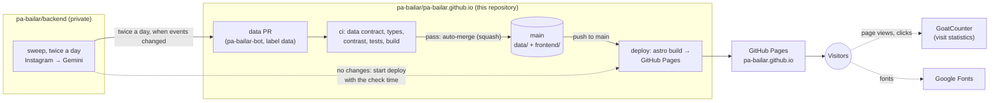
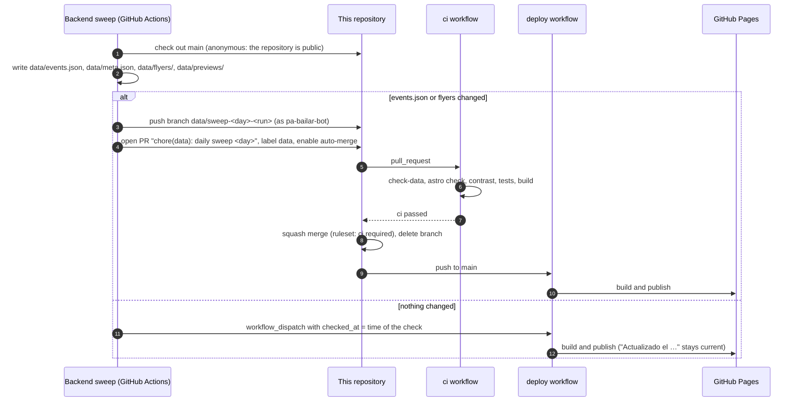
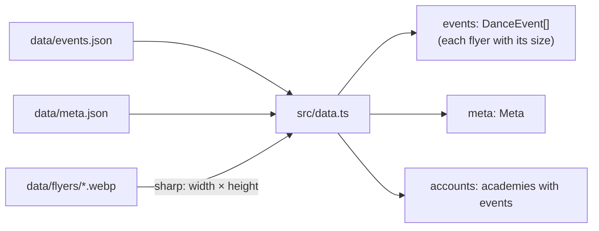
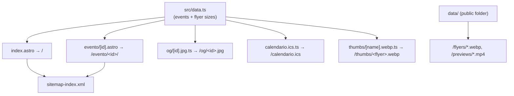
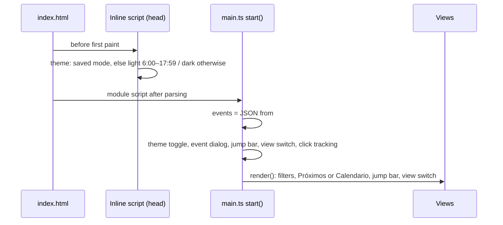
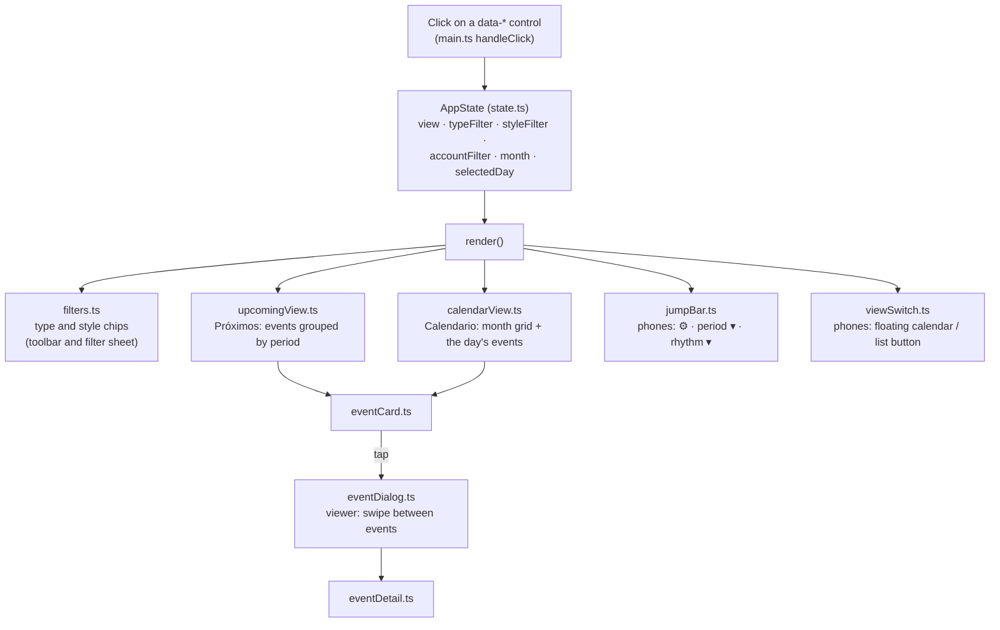
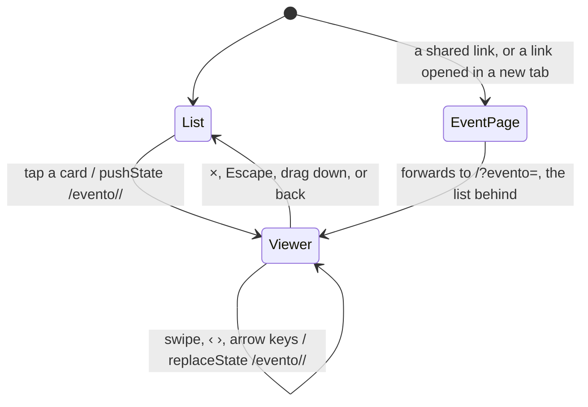

# Pa' Bailar: architecture (site)

How the site at <https://pa-bailar.github.io> gets its data, how it's built and published, and how it
works in the visitor's browser. This repository (`pa-bailar/pa-bailar.github.io`, public) holds the
site and the published data.

The collector that produces the data (Instagram → Gemini) is a separate, private repository
(`pa-bailar/backend`). Its `docs/ARCHITECTURE.md` covers the whole system's infrastructure in depth:
external services, the sweep, quotas, monitoring.

Related documents in this repository:
- [`DATA.md`](DATA.md): the data contract, every field of `events.json`.
- [`DESIGN.md`](DESIGN.md): the design system, every visual rule.

Last reviewed: 3 October 2026.

Contents:

1. [The site in one picture](#1-the-site-in-one-picture)
2. [How data reaches the site](#2-how-data-reaches-the-site)
3. [The build: from data/ to static files](#3-the-build-from-data-to-static-files)
4. [Publishing: workflows and protection](#4-publishing-workflows-and-protection)
5. [In the browser](#5-in-the-browser)
6. [Dates, time zones and holidays](#6-dates-time-zones-and-holidays)
7. [Third-party services](#7-third-party-services)
8. [Quality checks](#8-quality-checks)
9. [Code map](#9-code-map)
10. [Working on the site](#10-working-on-the-site)

---

## 1. The site in one picture

The site is **fully static**: HTML, CSS, a little JavaScript and images. It's built by Astro, served by
GitHub Pages, and has no server, database or API of its own. All of its data is in `data/`, which the
backend updates through pull requests.



| Folder | What | Who writes it |
|---|---|---|
| `data/` | `events.json`, `meta.json`, `flyers/*.webp`, `previews/*.mp4` (videos' clips). Also the site's public folder: flyers and clips are served as-is | The backend, only through data PRs |
| `frontend/` | The Astro site: pages, components, scripts, styles, tests | People, through PRs |
| `docs/` | Architecture (this file), data contract, design system | People |
| `.github/workflows/` | `ci` and `deploy` | People |

---

## 2. How data reaches the site

The backend's sweep runs twice a day, at 9 AM and 9 PM Bogotá time (cron-job.org starts its workflow), and
reads each account about once a day. It works on a checkout of this repository and writes `data/` exactly
as described in [`DATA.md`](DATA.md).



Notes:
- **Only real changes open a PR.** `meta.json` is rewritten on every run, but only events or flyers
  count as a change. Days without news don't fill the history with commits.
- **The bot's PRs are checked like anyone's.** The backend uses a GitHub App (pa-bailar-bot), not the
  default workflow token, so its PR triggers this repository's `ci`. A PR from the default token
  wouldn't trigger workflows.
- **A data PR can't break the site.** `check-data.mjs` checks every field against the contract, and the
  build must succeed before the PR can merge. If the backend ever writes something the site doesn't
  understand, the data PR stays open and the backend's run reports it.
- **"Actualizado el …"** in the header shows when the data was last **checked**, not when it last
  changed:
  - on days without changes, the backend starts the deploy with `checked_at`, which reaches the build as
    `PUBLIC_CHECKED_AT`;
  - otherwise, the build uses `meta.json`'s `generated_at`.
- **Old events leave on their own:** the backend deletes events dated more than 60 days ago, together
  with their flyers. Past events still in the data aren't shown in "Próximos", but their pages and the
  calendar keep them.

---

## 3. The build: from data/ to static files

`npm run build` (Astro 7). `astro.config.mjs` sets:
- the site's URL (`https://pa-bailar.github.io`);
- **`publicDir: "../data"`**, so the data folder is served at the site's root: `flyers/123-0.webp`
  becomes `https://pa-bailar.github.io/flyers/123-0.webp`;
- the `@astrojs/sitemap` integration;
- `import.meta.env.DATA_DIR`, the data folder's absolute path, so the build finds the flyers wherever
  it's started from.

### 3.1 Reading the data: `src/data.ts`



- **Typed once:** the JSON is cast to the types in `src/scripts/types.ts`, which mirror the backend's
  models. CI checked the files against the contract first.
- **Flyer sizes:** each flyer's pixel size is read at build time and added to its media item. Cards then
  show each flyer at its own shape without the page jumping while images load (section 5.4).
- **Build time only:** `data.ts` uses Node (`sharp`, the file system). The browser never imports it; it
  gets the data inside the page.

### 3.2 What the build generates

| Output | Source | What it is |
|---|---|---|
| `/` (`index.html`) | `pages/index.astro` | The app: header, toolbar, jump bar, both views, dialog, filter sheet. Every event is embedded as JSON (`<script type="application/json" id="events-data">`), and the browser renders the cards and calendar from it. The preview image is the brand's own (`/og/sitio.jpg`), not an event's flyer |
| `/evento/<id>/` | `pages/evento/[id].astro` | One page per event: where a shared link points. A browser is forwarded to the home page with the event open (section 5.3). Rendered at build time with the same markup as the dialog. Includes Open Graph tags (the flyer as the link preview) and schema.org `Event` data for search engines |
| `/og/<id>.jpg` | `pages/og/[id].jpg.ts` | Each event's link-preview image: its flyer as a 600 px JPEG. WebP isn't shown by every app, and WhatsApp skips images over about 300 KB |
| `/og/sitio.jpg` | `pages/og/sitio.jpg.ts` | The home page's link preview (1200×630): stripes, "Pa' Bailar", the tagline and the record. Drawn once with the site's fonts by `scripts/og-site.html` and stored as `src/assets/og-site.jpg` |
| `/thumbs/<flyer>.webp` | `pages/thumbs/[name].webp.ts` | A 160 px square thumbnail of every flyer, for the sheet with an event's posts (opened from the "▦ 16" badge on the flyer). A few KB each instead of the 100–200 KB flyer, so they show at once on a phone |
| `/calendario.ics` | `pages/calendario.ics.ts` | A subscribable calendar feed (iCalendar, RFC 5545) with every event. Rebuilt with the site, so subscribed calendars refresh on their own. No longer linked from the footer (it added little); kept so existing subscriptions keep working |
| `/manifest.webmanifest` | `pages/manifest.webmanifest.ts` | What lets a phone install the site like an app: name, colors, icons, full screen |
| `/icons/<name>.png` | `pages/icons/[name].png.ts` | The app icons (192, 512, maskable 512, Apple touch icon), made from SVG at build time |
| `/sw.js` | `pages/sw.js.ts` | The service worker: makes it installable and opens it offline with the last events (pages network first; flyers and build files cached). A new version per build |
| `/sitemap-index.xml` | `@astrojs/sitemap` | Home and every event page, for search engines (the 404 page is excluded) |
| `/404.html` | `pages/404.astro` | "Esta página no existe…", with a link home |
| `/flyers/*.webp` | `data/flyers/` (public folder) | The flyers, copied as they are |
| `/previews/*.mp4` | `data/previews/` (public folder) | Videos' clips (6 silent seconds), copied as they are |



**Shared code between build and browser:** the views in `src/scripts/` produce HTML strings, so the same
code renders an event's detail in the browser (the dialog) and at build time (the event page).

---

## 4. Publishing: workflows and protection

### 4.1 Workflows

| Workflow | Trigger | Steps | Permissions |
|---|---|---|---|
| `ci` | Every pull request (including data PRs, and title edits); manual | The PR title (Conventional Commits, `release.mjs check`). `npm ci`. Then `npm run check`, which is the data contract (`check-data.mjs`), `astro check` (strict TypeScript) and color contrast (`check-contrast.mjs`). Then `npm test` (Vitest), then `npm run build` | `contents: read` |
| `deploy` | Push to `main` (every merged PR); manual; the backend's sweep on days without changes (with `checked_at`) | **version** job: the version from the commits since the last tag (`release.mjs plan`); if they change the site, tag it and publish its GitHub Release. **build** job: `npm ci`, `npm run build` (with `PUBLIC_CHECKED_AT` and `PUBLIC_VERSION`), upload the Pages artifact. **deploy** job: publish to GitHub Pages (environment `github-pages`) | Version: `contents: write` (it runs no npm package). Build: `contents: read` only (it runs npm's install scripts). Deploy: `pages: write`, `id-token: write` |

- **One deploy at a time:** `concurrency: pages` without cancelling, so two merges in a row publish one
  after the other.
- **Node:** version 24 (`.nvmrc`), with an npm cache keyed on `frontend/package-lock.json`.
- **Versions:** squash merges make each PR one commit on `main`, titled like the PR. `feat` → minor,
  `fix`/`perf`/`refactor`/`copy`/`style`/`revert` → patch, `!` or `BREAKING CHANGE:` → major; `docs`, `chore`
  (data), `ci`, `test`, `build` → no version. The release notes group the PRs (features, fixes, other
  changes); the footer shows the version, linked to its release. The first tag, `v1.0.0`, marks where
  numbering started.

### 4.2 Protection of `main`

The `protect-main` ruleset is active with **no bypass**, for anyone including administrators and the bot:
- changes only arrive through pull requests;
- merges are squash only;
- the `ci` check must pass;
- force pushes and deleting `main` are blocked.

The repository allows auto-merge and deletes merged branches. Data PRs (label `data`) enable auto-merge
when opened, so they merge on their own once `ci` passes.

### 4.3 GitHub Pages

- **Source:** "GitHub Actions" (`build_type: workflow`): Pages serves whatever the `deploy` workflow
  uploads, not a branch.
- **URL:** the repository's name (`pa-bailar.github.io`) makes it the organization's root site:
  `https://pa-bailar.github.io/`.

---

## 5. In the browser

### 5.1 Start-up



- **No data request:** the events arrive inside the HTML, so the first render needs no network.
  The flyers load lazily as they come into view.
- **One delegated click listener** in `main.ts` handles every control marked with a `data-*` attribute:
  view, type, style, academy, clear filters, day, month, today, event.

### 5.2 State and rendering



- **The state is a plain object** (`state.ts`), and every change re-renders the visible parts. There's
  no framework: the views return HTML strings, inserted with `innerHTML` after escaping every value from
  the data (`lib/dom.ts`, `escapeHtml`).
- **Filtering:**
  - **Type:** social, workshop…
  - **Style:** filtering by a family ("salsa") also matches its variants ("salsa caleña").
  - **Academy:** set by tapping an academy's name on a card.

  Only values present in the current view are offered, so a chip never leads to an empty list.
- **"Próximos"** groups upcoming events by period: today, this week, this weekend, next week, the rest
  of the month, then one group per month for the next six months, and one per year beyond that
  (`groupByPeriod`). On phones, cards read like an Instagram feed. An event over several days (`end_date`)
  is upcoming until its last day, and once it has started it's listed under "Hoy" every day it goes on
  (`shownDay` in `lib/dates.ts`).
  Long lists stay short where it matters: the near periods show their flyers in full (six, then "Ver N más"),
  and later periods start as a summary row ("Ver los 23 eventos"); `DESIGN.md`, "Long lists".
- **"Calendario"** shows a month grid. Dots mark days with events, Colombian holidays are tinted, and
  the selected day's events are listed below. An event over several days is on each of its days
  (`groupByDay`), across months too: a festival from 31 October to 2 November shows in both months.
- **Keeping your place:**
  - when a filter changes while you're reading the list, the period you were in stays under the bar;
  - each view remembers its scroll position, so switching to the calendar and back returns you to the
    same spot.

### 5.3 The event viewer and URLs



- **The viewer is a `<dialog>`** with one slide per event on screen, in list order. Swiping uses CSS
  scroll snapping. On phones it's a bottom sheet you can drag down to close (`lib/sheet.ts`).
- **The address bar follows the event:**
  - opening pushes the event's own URL to the history, so the phone's back button closes the viewer;
  - swiping replaces it, so back still closes instead of stepping through events;
  - every event's URL is a real page (`/evento/<id>/`), so copying the address shares the event.
- **A shared link opens the app:** the event's page forwards a browser to the home page with `?evento=<id>`, which opens that event in the viewer with the list behind it (`main.ts`, `openSharedEvent`). Link previews and search engines read the event's page itself (they don't run scripts).
- **The event page** (`eventPage.ts`) is already rendered at build time; a browser leaves it for the app
  at once. Its script only adds the theme toggle, the sheet with an event's posts, and click tracking.
- **The actions** are plain links built in `lib/links.ts`:
  - "Ver en Instagram" opens the post;
  - "Compartir" opens the phone's share menu with the event's text and page URL (`views/sharing.ts`);
  - "Cómo llegar" opens Google Maps' search URL.

### 5.4 Flyers

- **Never cropped:** on phones each flyer shows at its own shape, from 4:5 (portrait) to 1.91:1
  (landscape), like Instagram's feed. The size comes from the build (section 3.1), so nothing jumps
  while images load.
- **Taller flyers, and every card on wide screens,** get a 4:5 frame, with the flyer fitted whole over a
  blurred copy of itself.
- **Lazy loading:** every card image uses `loading="lazy"` and `decoding="async"`.

### 5.5 Installing, saving and searching

- **Install:** `views/installPrompt.ts` offers it (a banner from the second visit, a footer link): Chrome/Edge's own dialog, or the steps on iPhone. It also registers the service worker (built site only).
- **Saved events** live in this browser (`lib/saved.ts`, localStorage); "Guardados" filters the list and the calendar to them.
- **Search** (`lib/search.ts`) runs on the events already in the page, accent-insensitive, every word anywhere in the event.
- **Sharing** (`views/sharing.ts`) goes through the phone's share menu: an event (its link, with the flyer as preview), a near period or the visitor's plans (an image drawn in the browser, `lib/shareCard.ts`, and a list for WhatsApp).

### 5.6 Themes

- **Two themes:** "Fania de día" (light) and "Noche Fania" (dark).
- **Three modes:** auto, light and dark. **Auto** follows the visitor's clock: light from 6:00 to 17:59,
  dark the rest of the day, switching on its own while the page is open.
- **Remembered** in `localStorage`. An inline script in `BaseLayout.astro` applies it before the first
  paint, so the page never flashes the wrong theme.
- **Colors** are CSS tokens with `light-dark()` (`styles/tokens.css`); [`DESIGN.md`](DESIGN.md) has
  them all.

---

## 6. Dates, time zones and holidays

- **Dates are Bogotá dates:** event dates are plain `YYYY-MM-DD` strings in Bogotá's local time.
  "Today" is always Bogotá's, whatever the visitor's or the build machine's time zone (`lib/dates.ts`,
  `todayIso`, with `Intl` and `America/Bogota`). Bogotá is UTC−5 all year.
- **Times** are shown in 12-hour format ("8:00 p. m.") and stored as `HH:MM` 24-hour. The ICS feed uses
  the `America/Bogota` time zone.
- **Events over several days** (`end_date`, `docs/DATA.md`): `lib/dates.ts` has `lastDay`, `isMultiDay`,
  `daysOf` and `shownDay`. They're past only after their last day (the event page's "Este evento ya
  pasó"). Calendars (`eventTimes`, the ICS feed) get them as all-day events from the first day to the day
  after the last, as the format's end is exclusive (13–15 November: `DTSTART;VALUE=DATE:20261113`,
  `DTEND;VALUE=DATE:20261116`); schema.org's `endDate` is the last day.
- **Adding days** (`addDays`) moves the calendar date, not 24-hour steps, so "Mañana" and "Próxima
  semana" stay right for a visitor whose time zone has daylight saving time.
- **Colombian holidays** (`lib/holidays.ts`) are calculated, not downloaded:
  - fixed dates;
  - holidays moved to the following Monday (Ley Emiliani);
  - holidays relative to Easter (Meeus' algorithm).

  The tests check them against the official 2026 and 2027 lists. In the calendar, holidays get a tint,
  and their label and heading say "Festivo".

---

## 7. Third-party services

| Service | What for | Data sent | If it's down |
|---|---|---|---|
| **GitHub Pages** | Hosting | | The site is down |
| **GoatCounter** (`jzamora9.goatcounter.com`) | Visit statistics, without cookies or personal data, so no consent banner is needed | Page views. Each event opened in the viewer, as a view of its page. Clicks on elements with `data-track` (Instagram, the contact links, "Cómo llegar", sharing, saving, installing, reports). Local testing isn't counted | Nothing breaks: the script is optional and wrapped in `try` (`lib/analytics.ts`) |
| **Instagram embed** (`instagram.com/embed.js`) | Showing a post inside the site when a visitor taps a flyer (videos play, carousels swipe) | Loaded only on that tap, never with the page: the post's link; Instagram's player then runs as Meta's code (and cookies) inside its frame | Our copy of the flyer stays, with "Abrir en Instagram" (also when a post's link can't be read) |
| **Google Fonts** | Shrikhand, Bodoni Moda (italic) and Instrument Sans | The font request | System fonts are used |
| **Instagram, WhatsApp, Google Maps** | Links the visitor chooses to open | Only what's in the link | |
| **Google Forms** (the author's account) | Reports and ideas: "¿Algo está mal? Repórtalo" in each event's detail (the event filled in, `lib/links.ts`, `feedbackUrl`) and "Escríbenos" in the footer. No account needed; answers go to a Google Sheet and an email | What the visitor writes, and the event it's about | Nothing on the site: it's a link |

Flyers are copies served from this repository, so the site never needs Instagram to show events. The
only Instagram content it loads is a post's player, and only when a visitor taps a flyer to watch it.

---

## 8. Quality checks

| Check | What it verifies | Where |
|---|---|---|
| Data contract | Every field of `events.json` and `meta.json`: types, allowed values (event types, styles, confidence), real dates and time formats, `end_date` after `date` and within 7 days, unique ids, usernames, post links (`instagram.com/<p, reel, reels or tv>/<code>/`), flyer and clip paths (inside `flyers/` and `previews/`) and their files existing, sorting | `frontend/scripts/check-data.mjs` |
| Types | `astro check`: strict TypeScript, including `noUncheckedIndexedAccess` | `tsconfig.json` |
| Color contrast | Every color pair the site uses, in both themes, against WCAG 2.2 AA. It reads the tokens from `tokens.css`, so it can't drift from the design system | `frontend/scripts/check-contrast.mjs` |
| Unit tests | Dates and Bogotá's "today", formatting, filtering and period grouping, holidays | `frontend/tests/*.test.ts` (Vitest) |
| Build | Every page, image and feed is generated | `npm run build` |

All five run in `ci` on every pull request, and the ruleset requires `ci` before merging.

---

## 9. Code map

```
frontend/
  astro.config.mjs        site URL, public folder (../data), sitemap, DATA_DIR
  vitest.config.ts        unit tests, with Astro's settings
  scripts/                check-data.mjs, check-contrast.mjs (run by npm run check); release.mjs (versions);
                          og-site.html (draws the home page's link preview)
  tests/                  Vitest tests, factories.ts (test events)
  src/
    data.ts               the data, typed, with flyer sizes (build time only)
    env.d.ts              the build's variables: PUBLIC_CHECKED_AT, PUBLIC_VERSION
    assets/og-site.jpg    the home page's link preview, drawn by scripts/og-site.html
    layouts/BaseLayout.astro   <head>: meta, previews, fonts, theme before paint, GoatCounter, the CSS
    pages/
      index.astro         the app
      evento/[id].astro   an event's page (forwards browsers to the app)
      og/[id].jpg.ts, og/sitio.jpg.ts   link previews
      thumbs/[name].webp.ts   flyer thumbnails
      icons/[name].png.ts, manifest.webmanifest.ts, sw.js.ts   installing (icons, manifest, service worker)
      calendario.ics.ts   the calendar feed (no longer linked)
      404.astro
    components/           SiteHeader, ThemeToggle, Stripes, ViewToolbar, ViewSwitch, JumpBar, FilterSheet,
                          CalendarView, EventDialog, PostsSheet, PostViewer, InstallOffer, SiteFooter
    scripts/
      main.ts             entry point of the home page: state, clicks, render
      eventPage.ts        entry point of an event's page
      state.ts            AppState, filtering, period grouping
      screenHistory.ts    the phone's back between the app's screens
      types.ts            DanceEvent, EventMedia, Meta, AppState (mirror of the backend's models)
      theme.ts, themeConfig.ts   theme modes
      views/              upcomingView, calendarView, eventCard, eventDetail, eventDialog, filters,
                          jumpBar, viewSwitch, postsSheet, postViewer, inlinePlayer, clips, saveButton,
                          sharing, installPrompt (HTML strings + their behavior)
      lib/                dates, holidays, format, links, contact, mediaLabel, search, saved, share,
                          shareText, shareCard, analytics, dom, icons, sheet, instagramEmbed
    styles/               tokens.css (design tokens), base.css, components/*.css
```

| Module | Responsibility |
|---|---|
| `data.ts` | Reads `data/`, adds flyer sizes, lists the academies |
| `state.ts` | The UI state; which events each view shows; grouping by period |
| `views/upcomingView.ts` | "Próximos" |
| `views/calendarView.ts` | "Calendario", with holidays |
| `views/eventCard.ts` | A card: flyer at its shape, date sticker, details |
| `views/eventDetail.ts` | An event's full detail (dialog and page): the flyer of each post, details, prices, actions |
| `views/eventDialog.ts` | The viewer: slides, swiping, URL history, closing |
| `screenHistory.ts` | History entries for the app's screens (academy, period, calendar, saved): the phone's back steps through them |
| `views/filters.ts` | Type and style chips, the academy notice |
| `views/jumpBar.ts` | Phones: the sticky bar, its menus, keeping your place, hiding on scroll |
| `views/viewSwitch.ts` | Phones: the floating calendar / list button |
| `lib/links.ts` | Every URL built from an event: flyer, clip, page, link preview, Maps, the report form |
| `lib/mediaLabel.ts` | What the label over a post's image says (Ver con sonido, Ver video, Ver las N), and which cards get a ▶ |
| `lib/sheet.ts` | Bottom sheets that drag to dismiss; panel sheets with their own back-button step |
| `lib/instagramEmbed.ts` | Instagram's player for a post, its script loaded on demand |
| `views/postsSheet.ts`, `views/postViewer.ts` | An event's posts (Flyers / Videos); a post watched inside the site |
| `views/inlinePlayer.ts` | A video tapped in the detail plays in the image's place (Instagram's player), removed when off screen |
| `views/clips.ts` | Videos' clips in the detail: the one on screen plays, silent and looping |
| `lib/contact.ts` | The organizer's contact as a link: Instagram, WhatsApp, phone or website |
| `lib/search.ts` | Search over the events in the page |
| `lib/saved.ts`, `views/saveButton.ts` | Saved events ("Guardados"): the ids in this browser; the bookmarks and toggles |
| `lib/share.ts`, `lib/shareText.ts`, `lib/shareCard.ts`, `views/sharing.ts` | Sharing through the phone's menu: the text, the image of a list, what each share button sends |
| `views/installPrompt.ts` | Installing the site like an app; registers the service worker |
| `lib/analytics.ts` | GoatCounter events |
| `lib/dom.ts`, `lib/icons.ts` | DOM helpers and `escapeHtml`; inline SVG icons |
| `lib/dates.ts`, `lib/holidays.ts`, `lib/format.ts` | Dates in Bogotá, Colombian holidays, Spanish formatting |

---

## 10. Working on the site

From `frontend/` (Node 24):

```bash
npm ci
npm run dev       # http://localhost:4321, with the current data/
npm run check     # data contract, types, contrast
npm test
npm run build     # frontend/dist/
```

Changes go on a branch, through a pull request with a Conventional Commits title, and merge when `ci`
passes. The README has the details. A visual change follows [`DESIGN.md`](DESIGN.md). A change to the
data's shape starts in the backend (`models.py`), then [`DATA.md`](DATA.md), `types.ts` and
`check-data.mjs` here, behind a new `schema_version`.
