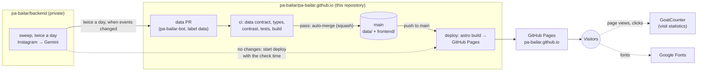
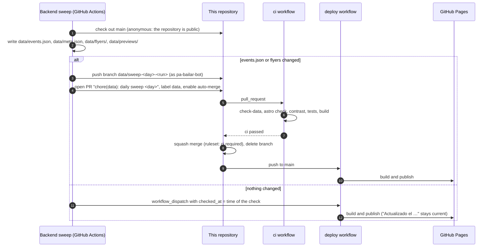
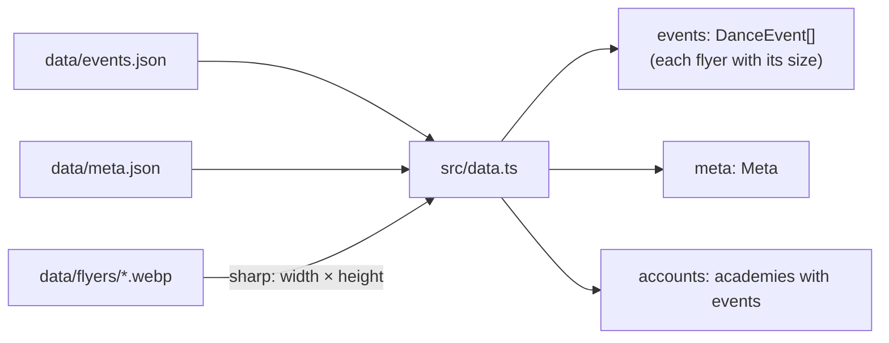
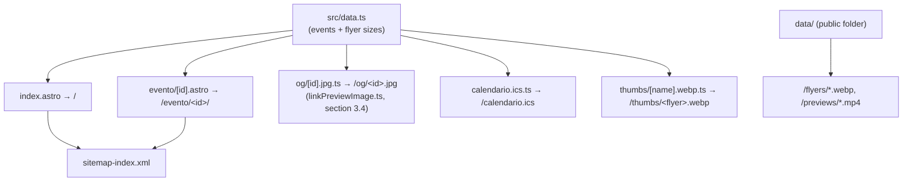
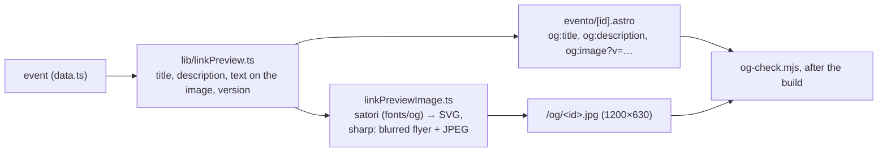
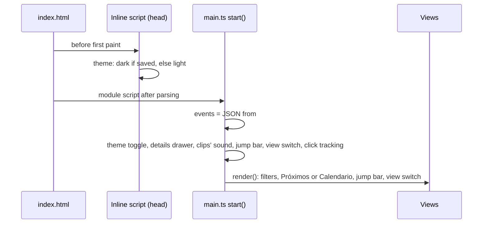
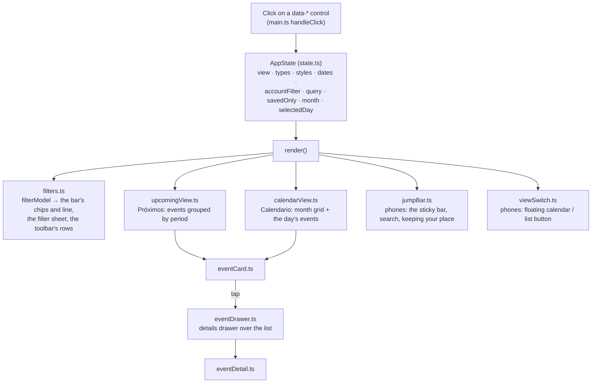
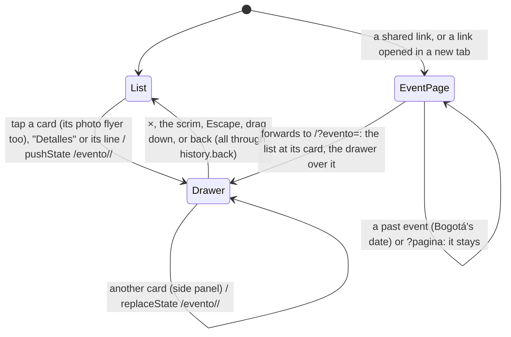

# Pa' Bailar: architecture (site)

How the site at <https://pa-bailar.github.io> gets its data, how it's built and published, and how it
works in the visitor's browser. This repository (`pa-bailar/pa-bailar.github.io`, public) holds the
site and the published data.

The collector that produces the data (Instagram → Gemini) is a separate, private repository
(`pa-bailar/backend`). Its `docs/ARCHITECTURE.md` covers the whole system's infrastructure in depth:
external services, the sweep, quotas, monitoring.

Related documents in this repository:
- [`DATA.md`](DATA.md): the data contract, every field of `events.json`.
- [`DESIGN.md`](DESIGN.md): the design system, every visual rule.

Last reviewed: 4 October 2026.

Contents:

1. [The site in one picture](#1-the-site-in-one-picture)
2. [How data reaches the site](#2-how-data-reaches-the-site)
3. [The build: from data/ to static files](#3-the-build-from-data-to-static-files)
4. [Publishing: workflows and protection](#4-publishing-workflows-and-protection)
5. [In the browser](#5-in-the-browser)
6. [Dates, time zones and holidays](#6-dates-time-zones-and-holidays)
7. [Third-party services](#7-third-party-services)
8. [Quality checks](#8-quality-checks)
9. [Code map](#9-code-map)
10. [Working on the site](#10-working-on-the-site)

---

## 1. The site in one picture

The site is **fully static**: HTML, CSS, a little JavaScript and images. It's built by Astro, served by
GitHub Pages, and has no server, database or API of its own. All of its data is in `data/`, which the
backend updates through pull requests.



| Folder | What | Who writes it |
|---|---|---|
| `data/` | `events.json`, `meta.json`, `flyers/*.webp`, `previews/*.mp4` (videos' clips). Also the site's public folder: flyers and clips are served as-is | The backend, only through data PRs |
| `frontend/` | The Astro site: pages, components, scripts, styles, tests | People, through PRs |
| `docs/` | Architecture (this file), data contract, design system | People |
| `.github/workflows/` | `ci` and `deploy` | People |

---

## 2. How data reaches the site

The backend's sweep runs twice a day, at 9 AM and 9 PM Bogotá time (cron-job.org starts its workflow), and
reads each account about once a day. It works on a checkout of this repository and writes `data/` exactly
as described in [`DATA.md`](DATA.md).



Notes:
- **Only real changes open a PR.** `meta.json` is rewritten on every run, but only events or flyers
  count as a change. Days without news don't fill the history with commits.
- **The bot's PRs are checked like anyone's.** The backend uses a GitHub App (pa-bailar-bot), not the
  default workflow token, so its PR triggers this repository's `ci`. A PR from the default token
  wouldn't trigger workflows.
- **A data PR can't break the site.** `check-data.mjs` checks every field against the contract, and the
  build must succeed before the PR can merge. If the backend ever writes something the site doesn't
  understand, the data PR stays open and the backend's run reports it.
- **"Actualizado el …"** in the header shows when the data was last **checked**, not when it last
  changed:
  - on days without changes, the backend starts the deploy with `checked_at`, which reaches the build as
    `PUBLIC_CHECKED_AT`;
  - otherwise, the build uses `meta.json`'s `generated_at`.
- **Old events leave on their own:** the backend deletes events dated more than 60 days ago, together
  with their flyers. Past events still in the data aren't shown in "Próximos", but their pages and the
  calendar keep them.

---

## 3. The build: from data/ to static files

`npm run build` (Astro 7). `astro.config.mjs` sets:
- the site's URL (`https://pa-bailar.github.io`);
- **`publicDir: "../data"`**, so the data folder is served at the site's root: `flyers/123-0.webp`
  becomes `https://pa-bailar.github.io/flyers/123-0.webp`;
- the `@astrojs/sitemap` integration;
- `import.meta.env.DATA_DIR`, the data folder's absolute path, so the build finds the flyers wherever
  it's started from;
- the Content Security Policy (`security.csp`, section 3.3) and the `csp-meta` integration that checks it.

### 3.1 Reading the data: `src/data.ts`



- **Typed once:** the JSON is cast to the types in `src/scripts/types.ts`, which mirror the backend's
  models. CI checked the files against the contract first.
- **Flyer sizes:** each flyer's pixel size is read at build time and added to its media item. Cards then
  show each flyer at its own shape without the page jumping while images load (section 5.4).
- **Build time only:** `data.ts` uses Node (`sharp`, the file system). The browser never imports it; it
  gets the data inside the page.

### 3.2 What the build generates

| Output | Source | What it is |
|---|---|---|
| `/` (`index.html`) | `pages/index.astro` | The app: header, toolbar, jump bar, both views, details drawer, filter sheet. Every event is embedded as JSON (`<script type="application/json" id="events-data">`), and the browser renders the cards and calendar from it. The preview image is the brand's own (`/og/sitio.jpg`), not an event's flyer |
| `/evento/<id>/` | `pages/evento/[id].astro` | One page per event: where a shared link points. A browser is forwarded to the home page with the event open over the list, unless it's past (section 5.3). Rendered at build time: the flyer, then the same details as the drawer. Includes the link preview's tags (section 3.4) and schema.org `Event` data for search engines |
| `/og/<id>.jpg` | `pages/og/[id].jpg.ts` | Each event's link-preview image: 1200×630, the flyer with the date, title, place and price (section 3.4) |
| `/og/sitio.jpg` | `pages/og/sitio.jpg.ts` | The home page's link preview (1200×630): stripes, "Pa' Bailar", the tagline and the record. Drawn once with the site's fonts by `scripts/og-site.html` and stored as `src/assets/og-site.jpg` |
| `/thumbs/<flyer>.webp` | `pages/thumbs/[name].webp.ts` | A 160 px square thumbnail of every flyer, for the sheet with an event's posts (opened from the "▦ 16" badge on the flyer). A few KB each instead of the 100–200 KB flyer, so they show at once on a phone |
| `/calendario.ics` | `pages/calendario.ics.ts` | A subscribable calendar feed (iCalendar, RFC 5545) with every event. Rebuilt with the site, so subscribed calendars refresh on their own. No longer linked from the footer (it added little); kept so existing subscriptions keep working |
| `/manifest.webmanifest` | `pages/manifest.webmanifest.ts` | What lets a phone install the site like an app: name, colors, icons, full screen |
| `/icons/<name>.png` | `pages/icons/[name].png.ts` | The app icons (192, 512, maskable 512, Apple touch icon), made from SVG at build time |
| `/sw.js` | `pages/sw.js.ts` | The service worker: makes it installable and opens it offline with the last events (pages network first; flyers and build files cached). A new version per build |
| `/sitemap-index.xml` | `@astrojs/sitemap` | Home and every event page, for search engines (the 404 page is excluded) |
| `/404.html` | `pages/404.astro` | "Este evento ya pasó o no existe" (most missing addresses are old event links, whose events were deleted), the first four upcoming events as of the build, and a link home. Any other address gets "Esta página no existe" (a small script reads the path) |
| `/flyers/*.webp` | `data/flyers/` (public folder) | The flyers, copied as they are |
| `/previews/*.mp4` | `data/previews/` (public folder) | Videos' clips (6 silent seconds), copied as they are |



**Shared code between build and browser:** the views in `src/scripts/` produce HTML strings, so the same
code renders an event's detail in the browser (the details drawer) and at build time (the event page).

### 3.3 The Content Security Policy

GitHub Pages can't send headers, so the policy is a `<meta http-equiv="content-security-policy">` in every
page. It tells the browser what the page may load and run; anything else (a script or style slipped into an
event's text, a link to another site's script) is blocked.

| Directive | Allows | For |
|---|---|---|
| `default-src` | `'self'` | Anything not listed below: only the site's own files |
| `script-src` | `'self'`, `https://www.instagram.com`, hashes | The build's bundles, our copy of GoatCounter's `count.js`, Instagram's `embed.js`; the inline scripts by their hash |
| `style-src` | `'self'`, `https://fonts.googleapis.com`, hashes | The CSS files, Google Fonts' stylesheet, the styles Astro inlines (by hash) |
| `style-src-attr` | `'unsafe-hashes'` + one hash | No `style=""` attributes, except the fixed one `embed.js` gives Instagram's player |
| `img-src` | `'self'`, `data:`, `https://jzamora9.goatcounter.com` | Flyers, thumbnails, icons; the favicon (a `data:` SVG); GoatCounter's fallback image |
| `media-src` | `'self'` | The videos' clips (`previews/`) |
| `font-src` | `https://fonts.gstatic.com` | Google Fonts |
| `connect-src` | `'self'`, `https://jzamora9.goatcounter.com` | GoatCounter's counts (`sendBeacon`) |
| `frame-src` | `https://www.instagram.com` | Instagram's player |
| `worker-src`, `manifest-src` | `'self'` | `sw.js`, `manifest.webmanifest` |
| `object-src`, `base-uri`, `form-action` | `'none'` | No plugins, no `<base>`, no forms |

- **Where it's set:** `astro.config.mjs` (`security.csp`). Astro adds the hashes of the scripts and styles it
  inlines. Ours are two inline scripts, the theme before first paint (`src/themeScript.ts`, in `BaseLayout.astro`) and the event pages'
  forward to the app (`evento/[id].astro`), written as strings and added with `allowInlineScript()`
  (`src/csp.ts`), which puts their hash in the page's policy.
- **Checked at every build** (`scripts/csp-meta.mjs`): Astro writes the `<meta>` at the end of `<head>`, where
  it wouldn't cover what comes before it; the integration moves it right after `<meta charset>`. It also fails
  the build if a page has an inline script or `<style>` the policy doesn't allow, or any `style=""` attribute.
  So a new inline script needs `allowInlineScript()`, and a style that depends on data is set from a script
  (`element.style`, which the policy allows), like the cards' flyer shape (`applyFlyerRatios`, `eventCard.ts`).
- **What a `<meta>` can't do:** `frame-ancestors` (who may frame the site), reports and other headers aren't
  possible on GitHub Pages.
- **`npm run dev` doesn't apply it** (Vite's dev server injects scripts). To try it: `npm run build` and
  `npm run preview`, then look for "Content Security Policy" errors in the console.

### 3.4 Link previews

What WhatsApp, Instagram, iMessage, Telegram and Facebook show when an event's link (`/evento/<id>/`) is shared.
They read the page's Open Graph tags (they don't run scripts) and download its image.



- **The text** (`scripts/lib/linkPreview.ts`, pure, tested): the title with the date, "Intensivo Ritmos Cubanos —
  dom 4 oct, 9:00 a. m." (over several days "Level Up Bachata Fusion Congress — 13–15 nov", without the time); the
  description, "Taller de salsa cubana · Cra 16 #52-46 · Desde $ 35.000 · Pa' Bailar"; the image's `alt`. Apps
  keep a preview for days, so dates are always real ones, never "Hoy" or "Mañana".
- **The tags** (`BaseLayout.astro`): `og:title`, `og:description`, `og:url`, `og:type`, `og:locale` (`es_CO`),
  `og:site_name`, `og:image` (absolute, with `?v=`), `og:image:width`, `og:image:height`, `og:image:type`,
  `og:image:alt`, and `twitter:card` `summary_large_image` with its title, description and image. Without the size,
  Facebook and WhatsApp may show no image on a link's first share (they haven't downloaded it yet). The home page
  keeps its own image (`/og/sitio.jpg`), with the same tags.
- **The image** (`src/linkPreviewImage.ts`, `pages/og/[id].jpg.ts`): 1200×630 (1.91:1, what every app shows whole;
  a vertical flyer alone gets cropped or shrunk). Its design is in [`DESIGN.md`](DESIGN.md), "Link previews".
  - **Text with the site's fonts, without system fonts:** satori lays out the text and turns it into SVG paths, with
    the TTF files in `src/assets/fonts/og/` (Shrikhand, Instrument Sans 400 and 600, Bodoni Moda Medium Italic, each
    with its SIL Open Font License). The build machine has no fonts, and satori reads neither WOFF2 nor system fonts.
    satori's version is pinned (`package.json`): an update can move text, so check the images after one.
  - **The flyer:** sharp blurs a copy of it for the background of the left half, fits the whole flyer over it with
    a soft shadow, draws the SVG on top and writes a JPEG (quality 84, full color resolution so the red and green
    text stays crisp; a busy flyer that would weigh more than 280 KB is written again at lower quality). A video's
    flyer is its frame, as everywhere. An event without a flyer gets the record of the app icon.
  - **Cost:** about 0.12 s per event: with 77 events the build takes about 10 s more (15 s instead of 5 s), and the
    images weigh about 115 KB each (9 MB in all, from 5 MB for the old 600 px flyers).
- **Corrections reach the apps** (`?v=`): apps cache a preview by its URL, and GitHub Pages can't send cache headers
  (it serves everything with a 10-minute cache). So the image's URL carries a short hash of what it shows
  (`previewVersion`): the days, time, title, place, price, the flyer's file and size, and `PREVIEW_DESIGN_VERSION`
  (bump it when the design changes). A corrected event gets a new URL, which apps fetch again; anything the image
  doesn't show (caption, styles, contact) keeps the old one, so nothing is fetched again for nothing. The page's own
  text (title, description) is read again whenever an app refreshes the link.
- **Checked at every build** (`scripts/og-check.mjs`): every event in `events.json` has its page with all the
  tags, and its `og:image` has a version and points to a file the build made, a 1200×630 JPEG as the tags say,
  under 280 KB (WhatsApp skips preview images over about 300 KB). Otherwise the build fails.
- **Old links:** events are deleted 60 days after they end (section 2), and their pages and images with them. Their
  links then open the 404 page, which says the event passed and lists what's next (section 3.2).

---

## 4. Publishing: workflows and protection

### 4.1 Workflows

| Workflow | Trigger | Steps | Permissions |
|---|---|---|---|
| `ci` | Every pull request (including data PRs, and title edits); manual | The PR title (Conventional Commits, `release.mjs check`). `npm ci`. Then `npm run check`, which is the data contract (`check-data.mjs`), `astro check` (strict TypeScript) and color contrast (`check-contrast.mjs`). Then `npm test` (Vitest), then `npm run build` | `contents: read` |
| `deploy` | Push to `main` (every merged PR); manual; the backend's sweep on days without changes (with `checked_at`) | **version** job: the version from the commits since the last tag (`release.mjs plan`); if they change the site, tag it and publish its GitHub Release. **build** job: `npm ci`, `npm run build` (with `PUBLIC_CHECKED_AT` and `PUBLIC_VERSION`), upload the Pages artifact. **deploy** job: publish to GitHub Pages (environment `github-pages`) | Version: `contents: write` (it runs no npm package). Build: `contents: read` only (it runs npm's install scripts). Deploy: `pages: write`, `id-token: write` |

- **One deploy at a time:** `concurrency: pages` without cancelling, so two merges in a row publish one
  after the other.
- **Node:** version 24 (`.nvmrc`), with an npm cache keyed on `frontend/package-lock.json`.
- **Versions:** squash merges make each PR one commit on `main`, titled like the PR. `feat` → minor,
  `fix`/`perf`/`refactor`/`copy`/`style`/`revert` → patch, `!` or `BREAKING CHANGE:` → major; `docs`, `chore`
  (data), `ci`, `test`, `build` → no version. The release notes group the PRs (features, fixes, other
  changes); the footer shows the version, linked to its release. The first tag, `v1.0.0`, marks where
  numbering started.

### 4.2 Protection of `main`

The `protect-main` ruleset is active with **no bypass**, for anyone including administrators and the bot:
- changes only arrive through pull requests;
- merges are squash only;
- the `ci` check must pass;
- force pushes and deleting `main` are blocked.

The repository allows auto-merge and deletes merged branches. Data PRs (label `data`) enable auto-merge
when opened, so they merge on their own once `ci` passes.

### 4.3 GitHub Pages

- **Source:** "GitHub Actions" (`build_type: workflow`): Pages serves whatever the `deploy` workflow
  uploads, not a branch.
- **URL:** the repository's name (`pa-bailar.github.io`) makes it the organization's root site:
  `https://pa-bailar.github.io/`.

---

## 5. In the browser

### 5.1 Start-up



- **No data request:** the events arrive inside the HTML, so the first render needs no network.
  The flyers load lazily as they come into view.
- **One delegated click listener** in `main.ts` handles every control marked with a `data-*` attribute:
  view, a filter chip (`data-filter` + `data-value`), academy, clear filters, clear search, ⚙, day, month, today,
  event, a card's posts.

### 5.2 State and rendering



- **The state is a plain object** (`state.ts`), and every change re-renders the visible parts. There's
  no framework: the views return HTML strings, inserted with `innerHTML` after escaping every value from
  the data (`lib/dom.ts`, `escapeHtml`).
- **Filtering** (`matchesFilters`): an event must pass every group (AND), and within the dates, the types and the
  rhythms any choice will do (OR):
  - **Dates** (`dates`, several): periods of the list ("hoy", "fin-de-semana", "2026-11"…) plus "manana"
    (`TOMORROW`). An event matches when any of its days from today falls in a chosen period (`matchesDates`), so an
    event over several days counts in each period it runs through. The list then shows it on its first such day
    (`listedDay`), and `groupByPeriod` gives "Mañana" a group of its own when it's chosen. Upcoming list only: the
    calendar ignores them.
  - **Types** (`types`, several): social, workshop…
  - **Rhythms** (`styles`, several): filtering by a family ("salsa") also matches its variants ("salsa caleña").
  - **Academy:** set by tapping an academy's name on a card.
  - **Search** and **Guardados**.

  The options (`filterModel` in `views/filters.ts`, pure and tested; `dateOptions` in `state.ts`) exist by the events in
  view before any filter, in a stable order, so chips never move; each is counted against the other groups
  (`matchesFilters(event, state, except)`), and one with nothing to show is `dimmed` (unless chosen), not hidden. The
  model also gives the bar's chips (`quickDates`, `quickStyles`: Salsa, Bachata, Urbano, Tango, fixed), every choice
  in use (`applied`) and those without a chip of their own (`extra`, removable chips after ⚙), ⚙'s badge (`active`,
  `activeFilterCount`: every choice; dates only in the list) and the count shown (`shown`). `summaryLine` writes the
  line under the bar ("12 eventos · Finde, Salsa"; in the calendar "5 eventos en octubre · Salsa"). `clearFilters`
  ("Limpiar") clears dates, rhythms, types and the academy, not the search nor Guardados. Filters live only in memory:
  not in the URL or storage, as before (`DESIGN.md`, "Filters").
- **"Próximos"** groups upcoming events by period: today, this week, this weekend, next week, the rest
  of the month, then one group per month for the next six months, and one per year beyond that
  (`groupByPeriod`). On phones, cards read like an Instagram feed. An event over several days (`end_date`)
  is upcoming until its last day, and once it has started it's listed under "Hoy" every day it goes on
  (`shownDay` in `lib/dates.ts`).
  Long lists stay short where it matters: the near periods show their flyers in full (six, then "Ver N más"),
  and later periods start as a summary row ("Ver los 23 eventos"); `DESIGN.md`, "Long lists".
- **"Calendario"** shows a month grid. Dots mark days with events, Colombian holidays are tinted, and
  the selected day's events are listed below. An event over several days is on each of its days
  (`groupByDay`), across months too: a festival from 31 October to 2 November shows in both months.
- **Keeping your place:**
  - when a filter changes while you're reading the list, the period you were in (the lowest one crossing a band
    under the bar, measured just before: `captureListPosition`) stays under the bar;
  - each view remembers its scroll position, so switching to the calendar and back returns you to the
    same spot.

### 5.3 The details drawer and URLs



- **The drawer is one `<dialog>`** (`EventDrawer.astro`, `views/eventDrawer.ts`) with one event's details in it
  (`eventDrawerHtml`: the head with when, the title, the type, the account and ×; then the quick actions and the
  details). No flyer: the card is right there. Two modes, chosen when it opens and switched if the window crosses
  900px while open (`show` / `swapMode`):

  ```mermaid
  stateDiagram-v2
      state "Drawer (phones, under 900px; modal)" as Sheet {
          [*] --> Medium
          Medium --> Full: pull up, scroll the content, wheel, the handle, keyboard focus below the fold
          Full --> Medium: pull down from the bar or the content's top, wheel up at the top, the handle
      }
      state "Side panel (900px and wider; not modal)" as Panel
      [*] --> Sheet: showModal()
      [*] --> Panel: show(), html.has-viewer-panel
      Sheet --> [*]: ×, scrim, Escape, back, drag down from Medium
      Panel --> [*]: ×, Escape, back
  ```

  - **Drawer:** the dialog covers the screen (`overflow: clip`, so focusing inside never scrolls it) with its own
    scrim (`--scrim`, its opacity following the drawer: 32% at half height, 55% at full) and the panel, moved by
    `--drawer-y` (its offset below full height). Its geometry and gestures are pure functions in
    `views/drawerSheet.ts` (tested): `offsetFor` (half height: the lower 55%; full: 12px from the top), `scrimAt`,
    `settle` (a flick of 0.5 px/ms goes its way; else past max(110px, 22% of the screen) below half height closes,
    else the nearer height; from full, a pull down lands at half), `exitDuration` (160–280ms) and `cardScrollDelta`
    (how far the list moves so the tapped card stays in view: only when it would be mostly hidden, then its flyer
    goes under the bar). Touch: at half height every vertical drag moves the drawer (`touch-action: none`); at full
    the content scrolls natively and the drawer follows the finger from its bar, or from the content's top pulling
    down. A mouse or pen drags the bar (pointer capture once it's a drag, so the handle's tap still works). Rise
    320ms, settle 300ms, CSS transitions; no motion with reduced motion.
  - **Modal:** `showModal()` makes the list inert and `html:has(dialog:modal)` stops it scrolling. The dialog has
    `autofocus`, so opening focuses the dialog itself, not its handle (which is still below the screen: focusing it
    scrolled the list); then the title takes the focus. Closing gives it back to what opened it.
  - **Side panel:** fixed on the right (`--panel-width`), opened with `show()` so the page stays usable; the page
    leaves room for it (`.has-viewer-panel`), the open event's card is outlined (`highlightCurrentCard`, also after
    each render), and Escape is handled by the page (a non-modal dialog doesn't get it). A card tapped while it's
    open shows its event there and replaces the URL.
- **Every close goes through the history:** ×, the scrim, Escape and a drag call `history.back()`, and the
  `popstate` slides it away from where the finger left it (`requestClose` → `leave`); the back button does the same.
  Safari's edge swipe (`hasUAVisualTransition`) closes it at once. Back from a sheet over the drawer (posts, a post)
  lands on the same event, and the drawer stays.
- **One event, nothing kept:** only the open event's details are rendered, with no image; closing empties the
  drawer (section 5.7).
- **The address bar follows the event:** opening pushes the event's own URL (`/evento/<id>/`), so the phone's back
  button closes it; every event's URL is a real page, so copying the address shares the event.
- **A shared link opens the app:** the event's page forwards a browser to `/?evento=<id>` (its inline script, unless
  the event is past in Bogotá's date, or `?pagina` is set). `openSharedEvent` (`main.ts`) takes the parameter off the
  address (keeping the others, like `utm_source`), finds the event's card (`sharedEventEntry`, `upcomingView.ts`:
  its period opened whole first if it's summarized or past "Ver N más"), waits for the fonts and a laid-out frame,
  then opens the drawer with the list scrolled to the card (`shared`: its flyer loads at once) and counts
  `detalles-enlace`. An event not in the list goes back to its page with `?pagina=1`. Link previews and search
  engines read the event's page itself (they don't run scripts).
- **The event page** (`eventPage.ts`) is already rendered at build time (the flyer, then the drawer's details); a
  browser leaves it for the app at once. Its script adds the theme toggle, the clips, the posts sheet and media
  viewer, and click tracking.
- **The media:** "Ver el video con sonido" and "Ver las 4 imágenes" open the post in the media viewer
  (`postViewer.ts`, Instagram's player); "Ver las 3 publicaciones" and a card's "▦ 3" open the posts sheet
  (`postsSheet.ts`), whose chosen post opens in the media viewer in its place (`openPanelSheet(…, { replacing })`
  takes over the sheet's history entry). On the event page, the flyer still plays a video in place
  (`inlinePlayer.ts`).
- **The actions** are plain links built in `lib/links.ts`:
  - "Ver en Instagram" opens the post;
  - "Compartir" opens the phone's share menu with the event's text and page URL (`views/sharing.ts`);
  - "Cómo llegar" opens Google Maps' search URL.

### 5.4 Flyers

- **Never cropped:** on phones each flyer shows at its own shape, from 4:5 (portrait) to 1.91:1
  (landscape), like Instagram's feed. The size comes from the build (section 3.1), so nothing jumps
  while images load.
- **Taller flyers, and every card on wide screens,** get a 4:5 frame, with the flyer fitted whole over a
  blurred copy of itself.
- **Lazy loading:** every card image uses `loading="lazy"` and `decoding="async"` (a shared link's card loads at once).
- **Videos' clips in the feed:** a card whose image is a video with a clip shows a `<video data-clip>` with the flyer as
  its poster, played silent by `views/clips.ts` (section 5.7); a tap there toggles its sound (`initClipSound`).

### 5.5 Installing, saving and searching

- **Install:** `views/installPrompt.ts` offers it (a banner under the header, a footer link): Chrome/Edge's own dialog, or a sheet with the steps for where the visitor is (`lib/installPlace.ts`, from the user agent: Safari 26, earlier Safari, other iPhone browsers, apps' own browsers, Android). On iPhone the page can't tell whether it was added, so "Ya la agregué" and closing the steps hide the banner (section 5.7). It also registers the service worker (built site only).
- **Saved events** live in this browser (`lib/saved.ts`, localStorage); "Guardados" filters the list and the calendar to them.
- **Search** (`lib/search.ts`) runs on the events already in the page, accent-insensitive, every word anywhere in the event.
- **Sharing** (`views/sharing.ts`) goes through the phone's share menu: an event (its link, whose preview shows the flyer, date, title, place and price: section 3.4), a near period or the visitor's plans (an image drawn in the browser, `lib/shareCard.ts`, and a list for WhatsApp).

### 5.6 Themes

- **Two themes:** "Fania de día" (light) and "Luz de escenario" (dark).
- **Light by default** for everyone, not the device's setting nor the time. A two-way switch, "Claro" /
  "Oscuro" (`ThemeToggle.astro`, `scripts/theme.ts`).
- **Remembered** in `localStorage`, key `theme`, value `light` or `dark`; any other value (the old `auto`)
  reads as light and is removed. Blocked storage: the switch works for the visit only.
- **Before first paint:** an inline script (`src/themeScript.ts`, put in `<head>` by `BaseLayout.astro`) sets
  `<html data-theme>` and the `theme-color` meta from the saved value, so a dark choice never flashes light
  (allowed by its hash, section 3.3). CSS defaults to `color-scheme: light`; `[data-theme=dark]` switches.
  The rule and colors live in `scripts/themeConfig.ts`, shared by both; `tests/theme.test.ts` runs the inline
  script against the same cases.
- **Colors** are CSS tokens with `light-dark()` (`styles/tokens.css`); [`DESIGN.md`](DESIGN.md) has
  them all. The dark theme adds its lighting (`--stage-light`, `--grain`, painted by `base.css`); the calendar uses
  the same colors. `check-contrast.mjs` checks every pair in both themes.

### 5.7 iPhone (Safari)

Every browser on an iPhone is Safari's engine (WebKit), with its own limits:
- **Memory.** iOS closes a tab that uses too much memory ("A problem repeatedly occurred on…", the page
  reloads), with no error the page can catch. Decoded images are the big cost: a 1080×1350 flyer is about
  6 MB once decoded, whatever its file size. So:
  - the details drawer renders one event's text and no image at all: the flyer is the card's, already on screen
    (section 5.3). Closing it empties it. (An earlier viewer rendered a slide per event of the list, 35 flyers and
    every clip at once: about 190 MB decoded, which made iPhones close the page; then the current event and its
    neighbors, with their flyers again over the list.)
  - videos' clips (`views/clips.ts`), in the feed and on an event's page: `preload="none"`, muted, `playsinline`,
    one playing at a time (≤ 1 clip decoding); a clip that leaves the screen pauses, goes silent and unloads (its
    `src` set aside and the video reloaded empty, put back when it's seen again); a clip whose card is redrawn away is
    released. Something over the list holds them (`holdClips`): the full drawer covers them, and the media viewer
    plays the post with sound;
  - Instagram's player (an iframe) is removed when the media viewer closes, and on an event's page when the video
    playing in place goes off screen.
- **One bad event can't break the drawer:** if its details fail to render, it shows a link to the event's page
  instead (`eventDrawer.ts`).
- **Installing** has no browser dialog: the page is added from the share menu. Where that menu is depends on
  the browser and the version, so `lib/installPlace.ts` reads the user agent:
  - Safari 26 (iOS 26 reports itself as iOS 18.6, so Safari's own `Version/26` tells): ⋯ at the bottom right →
    Compartir → Agregar a inicio → Abrir como app web → Agregar (with the top or bottom bar layouts, Compartir is
    in the bar);
  - Safari 18 and earlier: Compartir in the middle of the bottom bar → Agregar a inicio → Agregar (iPad: at the
    top right);
  - Chrome, Edge, Firefox: their own Compartir, then the same menu (iOS 16.4 or later; earlier, only Safari:
    the steps say so, with "Copiar enlace");
  - Instagram, Facebook, TikTok, the Google app…: their own browsers can't install; open it in Safari, or copy
    the link.

  The home-screen app keeps its storage apart from Safari, and Safari can't ask whether it's installed. It's
  recognized when it runs (`display-mode: standalone`, `navigator.standalone`), and shows no offer there.
- **Head tags:** `apple-touch-icon` (180×180, opaque, iOS rounds it) and `apple-mobile-web-app-title`
  (`BaseLayout.astro`); iOS takes the rest (name, full screen) from the manifest.

---

## 6. Dates, time zones and holidays

- **Dates are Bogotá dates:** event dates are plain `YYYY-MM-DD` strings in Bogotá's local time.
  "Today" is always Bogotá's, whatever the visitor's or the build machine's time zone (`lib/dates.ts`,
  `todayIso`, with `Intl` and `America/Bogota`). Bogotá is UTC−5 all year.
- **Times** are shown in 12-hour format ("8:00 p. m.") and stored as `HH:MM` 24-hour. The ICS feed uses
  the `America/Bogota` time zone.
- **Events over several days** (`end_date`, `docs/DATA.md`): `lib/dates.ts` has `lastDay`, `isMultiDay`,
  `daysOf` and `shownDay`. They're past only after their last day (the event page's "Este evento ya
  pasó"). Calendars (`eventTimes`, the ICS feed) get them as all-day events from the first day to the day
  after the last, as the format's end is exclusive (13–15 November: `DTSTART;VALUE=DATE:20261113`,
  `DTEND;VALUE=DATE:20261116`); schema.org's `endDate` is the last day.
- **Adding days** (`addDays`) moves the calendar date, not 24-hour steps, so "Mañana" and "Próxima
  semana" stay right for a visitor whose time zone has daylight saving time.
- **Colombian holidays** (`lib/holidays.ts`) are calculated, not downloaded:
  - fixed dates;
  - holidays moved to the following Monday (Ley Emiliani);
  - holidays relative to Easter (Meeus' algorithm).

  The tests check them against the official 2026 and 2027 lists. In the calendar, holidays get a tint,
  and their label and heading say "Festivo".

---

## 7. Third-party services

| Service | What for | Data sent | If it's down |
|---|---|---|---|
| **GitHub Pages** | Hosting | | The site is down |
| **GoatCounter** (`jzamora9.goatcounter.com`) | Visit statistics, without cookies or personal data, so no consent banner is needed | Page views. Each event opened in the details drawer, as a view of its page. Where details were opened from, as events: `detalles-tarjeta` (the card), `detalles-boton` (its "Detalles"), `detalles-linea` (the line under it), `detalles-enlace` (a shared link; `detailsEventName`). Clicks on elements with `data-track` (Instagram, the contact links, "Cómo llegar", sharing, including `compartir-tarjeta` from a card's row, saving, installing, reports). Local testing isn't counted. Its script (`count.js`) is a copy served from the site (`src/vendor/goatcounter-count.js`, ISC license), not loaded from `gc.zgo.at`: the policy (section 3.3) then allows no other script host, and GoatCounter keeps its `/count` endpoint compatible, so the copy needs no updates | Nothing breaks: the script is optional and wrapped in `try` (`lib/analytics.ts`) |
| **Instagram embed** (`instagram.com/embed.js`) | Showing a post inside the site (the media viewer: "Ver el video con sonido", a post chosen among the event's posts, an event page's flyer; videos play, carousels swipe) | Loaded only on that tap, never with the page: the post's link; Instagram's player then runs as Meta's code (and cookies) inside its frame | Our copy of the flyer stays, with "Abrir en Instagram" (also when a post's link can't be read) |
| **Google Fonts** | Shrikhand, Bodoni Moda (italic) and Instrument Sans | The font request | System fonts are used |
| **Instagram, WhatsApp, Google Maps** | Links the visitor chooses to open | Only what's in the link | |
| **Google Forms** (the author's account) | Reports and ideas: "¿Algo está mal? Repórtalo" in each event's detail (the event filled in, `lib/links.ts`, `feedbackUrl`) and "Escríbenos" in the footer. No account needed; answers go to a Google Sheet and an email | What the visitor writes, and the event it's about | Nothing on the site: it's a link |

Flyers are copies served from this repository, so the site never needs Instagram to show events. The
only Instagram content it loads is a post's player, and only when a visitor taps a flyer to watch it.

---

## 8. Quality checks

| Check | What it verifies | Where |
|---|---|---|
| Data contract | Every field of `events.json` and `meta.json`: types, allowed values (event types, styles, confidence), real dates and time formats, `end_date` after `date` and within 7 days, unique ids, usernames, post links (`instagram.com/<p, reel, reels or tv>/<code>/`), flyer and clip paths (inside `flyers/` and `previews/`) and their files existing, sorting | `frontend/scripts/check-data.mjs` |
| Types | `astro check`: strict TypeScript, including `noUncheckedIndexedAccess` | `tsconfig.json` |
| Color contrast | Every color pair the site uses, in both themes, against WCAG 2.2 AA. It reads the tokens from `tokens.css`, so it can't drift from the design system | `frontend/scripts/check-contrast.mjs` |
| Unit tests | Dates and Bogotá's "today", formatting, filtering (rhythms and dates, "Mañana", the options and their counts) and period grouping, holidays, the policy check, where the visitor can install from and its steps, the filter chips (`filterModel`: the bar's chips, dimmed vs hidden options, multiple types, removable chips, the badge, the line, the calendar's line; "Limpiar"'s scope; empty results), the drawer (`drawerSheet.ts`: its heights, scrim, where a drag ends and the ways it closes, keeping the tapped card in view), a shared link's entry (`sharedEventEntry`: the period to open, or the page for a past event), what the details add (a card's line, the drawer's order, no image, its media links and price line), the analytics names for opened details, things shown once (`onceFlag`, with and without storage), link previews (their text, the image's version, one image drawn with and one without a flyer), the theme (the saved value, old ones, and the script before first paint) | `frontend/tests/*.test.ts` (Vitest) |
| Build | Every page, image and feed is generated; every page's Content Security Policy allows its inline scripts and styles, and no page has a `style=""` attribute (section 3.3); every event's link preview has its tags and a 1200×630 JPEG under 280 KB (section 3.4) | `npm run build`, `frontend/scripts/csp-meta.mjs`, `frontend/scripts/og-check.mjs` |

All five run in `ci` on every pull request, and the ruleset requires `ci` before merging.

---

## 9. Code map

```
frontend/
  astro.config.mjs        site URL, public folder (../data), sitemap, DATA_DIR, Content Security Policy
  vitest.config.ts        unit tests, with Astro's settings
  scripts/                check-data.mjs, check-contrast.mjs (run by npm run check); release.mjs (versions);
                          og-site.html (draws the home page's link preview); csp-meta.mjs (the policy, after
                          the build); og-check.mjs (the events' link previews, after the build)
  tests/                  Vitest tests, factories.ts (test events)
  src/
    data.ts               the data, typed, with flyer sizes (build time only)
    csp.ts                allowInlineScript(): an inline script, allowed by its hash (build time only)
    themeScript.ts        the theme before first paint, an inline script (build time only)
    linkPreviewImage.ts   an event's link-preview image: satori + sharp (build time only)
    vendor/goatcounter-count.js   GoatCounter's script, served from the site
    env.d.ts              the build's variables: PUBLIC_CHECKED_AT, PUBLIC_VERSION
    assets/og-site.jpg    the home page's link preview, drawn by scripts/og-site.html
    assets/fonts/og/      the fonts drawn into the events' link previews (TTF, with their OFL licenses)
    layouts/BaseLayout.astro   <head>: meta, previews, fonts, theme before paint, GoatCounter, the CSS
    pages/
      index.astro         the app
      evento/[id].astro   an event's page (forwards browsers to the app)
      og/[id].jpg.ts, og/sitio.jpg.ts   link previews
      thumbs/[name].webp.ts   flyer thumbnails
      icons/[name].png.ts, manifest.webmanifest.ts, sw.js.ts   installing (icons, manifest, service worker)
      calendario.ics.ts   the calendar feed (no longer linked)
      404.astro
    components/           SiteHeader, ThemeToggle, Stripes, ViewToolbar, ViewSwitch, JumpBar, FilterSheet,
                          CalendarView, EventDrawer, PostsSheet, PostViewer, InstallOffer, SiteFooter
    scripts/
      main.ts             entry point of the home page: state, clicks, render
      eventPage.ts        entry point of an event's page
      state.ts            AppState, filtering, period grouping
      screenHistory.ts    the phone's back between the app's screens
      types.ts            DanceEvent, EventMedia, Meta, AppState (mirror of the backend's models)
      theme.ts, themeConfig.ts   the Claro / Oscuro switch, its rule and colors
      views/              upcomingView, calendarView, eventCard, eventDetail, eventDrawer, drawerSheet,
                          filters, jumpBar, viewSwitch, postsSheet, postViewer, inlinePlayer, clips, saveButton,
                          sharing, installPrompt, detailsHint (HTML strings + their
                          behavior)
      lib/                dates, holidays, format, links, linkPreview, contact, mediaLabel, search, saved,
                          share, shareText, shareCard, analytics, dom, icons, sheet, instagramEmbed, installPlace,
                          onceFlag
    styles/               tokens.css (design tokens), base.css, components/*.css
```

| Module | Responsibility |
|---|---|
| `data.ts` | Reads `data/`, adds flyer sizes, lists the academies |
| `state.ts` | The UI state; filtering (AND across groups, OR within dates, types and rhythms); ⚙'s count; "Limpiar"; grouping by period; the date options |
| `views/upcomingView.ts` | "Próximos"; where a shared link's event is (`sharedEventEntry`) |
| `views/calendarView.ts` | "Calendario", with holidays |
| `views/eventCard.ts` | A card: flyer at its shape (or a video's clip, with its sound button), date sticker, the posts' badge, the action row (Detalles, Compartir, Guardar), details, the line naming what the details add |
| `views/detailsHint.ts`, `lib/onceFlag.ts` | The first visit's pulse on the first card's "Detalles"; things shown once per browser |
| `views/eventDetail.ts` | An event's details (the drawer's, and the event page's with the flyer on top): head, quick actions, details, prices, media links; their clicks |
| `views/eventDrawer.ts`, `views/drawerSheet.ts` | The details: a drawer over the list on phones (half / full height, drag, scrim, keeping the card in view) and a side panel on wide screens; URL history, closing; the geometry and gestures' pure part |
| `screenHistory.ts` | History entries for the app's screens (academy, period, calendar, saved): the phone's back steps through them |
| `views/filters.ts` | The filters' model (`filterModel`: options, counts, dimmed, the bar's chips, what's applied, the badge, the line) and drawing it: the phone bar's chips and line, the filter sheet, the toolbar's rows and status; empty results |
| `views/jumpBar.ts` | Phones: the sticky bar (search, the filter sheet), keeping your place, hiding on scroll, scrolling on purpose |
| `views/viewSwitch.ts` | Phones: the floating calendar / list button |
| `lib/links.ts` | Every URL built from an event: flyer, clip, page, link preview, Maps, the report form |
| `lib/linkPreview.ts`, `linkPreviewImage.ts` | A shared link's preview: its title, description, the image's text and version; the image itself (build time) |
| `lib/mediaLabel.ts` | What the label over a post's image says (Ver con sonido, Ver video, Ver las N), and which cards get a ▶ |
| `lib/sheet.ts` | Bottom sheets that drag to dismiss; panel sheets with their own back-button step |
| `lib/instagramEmbed.ts` | Instagram's player for a post, its script loaded on demand |
| `views/postsSheet.ts`, `views/postViewer.ts` | An event's posts (Flyers / Videos); a post watched inside the site (the media viewer) |
| `views/inlinePlayer.ts` | A video tapped in the detail plays in the image's place (Instagram's player), removed when off screen |
| `views/clips.ts` | Videos' clips in the feed and on an event's page: the one on screen plays, silent and looping, one at a time; a tap toggles a card's sound; held under the full drawer and the media viewer; unloaded off screen, released when they leave the page |
| `lib/contact.ts` | The organizer's contact as a link: Instagram, WhatsApp, phone or website |
| `lib/search.ts` | Search over the events in the page |
| `lib/saved.ts`, `views/saveButton.ts` | Saved events ("Guardados"): the ids in this browser; the bookmarks and toggles |
| `lib/share.ts`, `lib/shareText.ts`, `lib/shareCard.ts`, `views/sharing.ts` | Sharing through the phone's menu: the text, the image of a list, what each share button sends |
| `views/installPrompt.ts`, `lib/installPlace.ts` | Installing the site like an app: the offer, and the steps for each browser; registers the service worker |
| `lib/analytics.ts` | GoatCounter events: page views of events, clicks (`data-track`), where details were opened from |
| `lib/dom.ts`, `lib/icons.ts` | DOM helpers and `escapeHtml`; inline SVG icons |
| `lib/dates.ts`, `lib/holidays.ts`, `lib/format.ts` | Dates in Bogotá, Colombian holidays, Spanish formatting |

---

## 10. Working on the site

From `frontend/` (Node 24):

```bash
npm ci
npm run dev       # http://localhost:4321, with the current data/
npm run check     # data contract, types, contrast
npm test
npm run build     # frontend/dist/
npm run preview   # the build, as published (with its Content Security Policy)
```

Changes go on a branch, through a pull request with a Conventional Commits title, and merge when `ci`
passes. The README has the details. A visual change follows [`DESIGN.md`](DESIGN.md). A change to the
data's shape starts in the backend (`models.py`), then [`DATA.md`](DATA.md), `types.ts` and
`check-data.mjs` here, behind a new `schema_version`.
